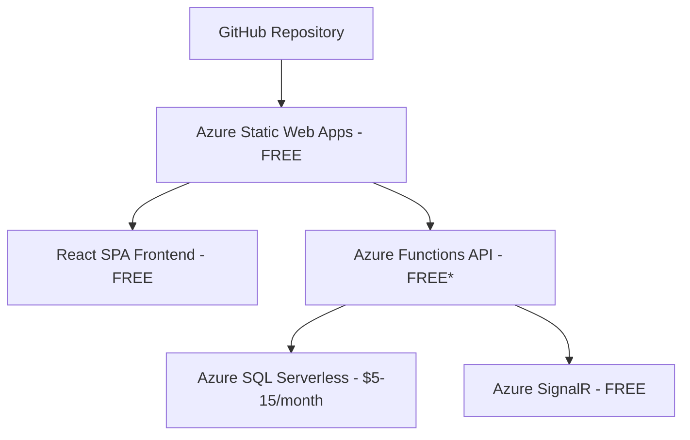
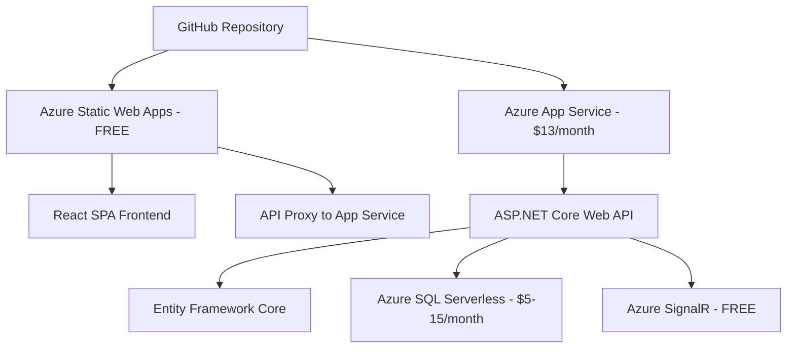

# 🥋 TKD Hub Azure Deployment Guide

> **Production-ready deployment guide for TKD Hub API on Microsoft Azure**

This comprehensive guide provides step-by-step instructions for deploying the TKD Hub application to Microsoft Azure with cost-optimized configurations suitable for production environments.

## � Table of Contents

- [�🚀 Quick Start](#-quick-start)
- [💰 Cost Analysis](#-cost-analysis)
- [📋 Prerequisites](#-prerequisites)
- [🏗️ Architecture Options](#️-architecture-options)
- [⚡ Option 1: Ultra-Low-Cost (Azure Static Web Apps)](#-option-1-ultra-low-cost-azure-static-web-apps)
- [💪 Option 2: Production-Ready (ASP.NET Core Web API)](#-option-2-production-ready-aspnet-core-web-api)
- [🔧 Configuration & Testing](#-configuration--testing)
- [🚀 Post-Deployment](#-post-deployment)
- [🛠️ Troubleshooting](#️-troubleshooting)

## 🚀 Quick Start

Choose your deployment path:

| Scenario | Recommended Option | Est. Cost | Deployment Time |
|----------|-------------------|-----------|-----------------|
| **MVP/Learning** | [Ultra-Low-Cost](#-option-1-ultra-low-cost-azure-static-web-apps) | $5-15/month | ~30 minutes |
| **Production App** | [ASP.NET Core Web API](#-option-2-production-ready-aspnet-core-web-api) | $18-28/month | ~45 minutes |

## 💰 Cost Analysis

### Cost Comparison

| Deployment Type | Monthly Cost | Best For | Components |
|----------------|--------------|----------|------------|
| **Ultra-Low-Cost** | **$5-15** | MVPs, Learning, Low Traffic | Static Web Apps + SQL Serverless + SignalR FREE |
| **Production-Ready** | **$18-28** | Production Apps, Teams | App Service + Static Web Apps + SQL Serverless |
| **Enterprise** | **$80-150+** | High Traffic, Multi-region | Premium tiers with advanced features |

### 💡 Cost-Saving Features

- ✅ **Azure Static Web Apps**: FREE hosting for React frontend
- ✅ **SQL Database Serverless**: Auto-pause when not in use
- ✅ **SignalR Service**: FREE tier (up to 20 connections)
- ✅ **GitHub CI/CD**: Automatic deployments at no extra cost
- ✅ **SSL & Custom Domains**: Included free
- ✅ **Up to 94% cost reduction** vs traditional hosting


## 📋 Prerequisites

### Required Tools

- **Azure CLI** - [Install Azure CLI](https://docs.microsoft.com/en-us/cli/azure/install-azure-cli)
- **Azure subscription** with Contributor permissions
- **.NET 8.0 SDK** - [Download .NET 8.0](https://dotnet.microsoft.com/download/dotnet/8.0)
- **Node.js 18+** - [Download Node.js](https://nodejs.org/)
- **PowerShell 5.1+** or **PowerShell Core 7+**
- **Git** - For source control and deployments

### Required Accounts

- **Microsoft Azure subscription** - [Get free Azure account](https://azure.microsoft.com/free/)
- **GitHub account** - For CI/CD and source control
- **MercadoPago developer account** - [Create MercadoPago account](https://www.mercadopago.com.ar/developers) (for payment processing)

### Pre-deployment Checklist

- [ ] Azure CLI installed and logged in (`az login`)
- [ ] .NET 8.0 SDK installed (`dotnet --version`)
- [ ] Node.js 18+ installed (`node --version`)
- [ ] GitHub repository created with your TKD Hub code
- [ ] MercadoPago test/production credentials ready


## 🏗️ Architecture Options

TKD Hub supports two deployment architectures, each optimized for different use cases and budgets.

### Architecture Comparison

| Feature | Ultra-Low-Cost | Production-Ready |
|---------|----------------|------------------|
| **Frontend Hosting** | Azure Static Web Apps (FREE) | Azure Static Web Apps (FREE) |
| **API Hosting** | Azure Functions (FREE*) | Azure App Service ($13/month) |
| **Database** | SQL Serverless ($5-15/month) | SQL Serverless ($5-15/month) |
| **Entity Framework** | ❌ Limited support | ✅ Full EF Core support |
| **Auto Migrations** | ❌ Manual setup required | ✅ Automatic on deployment |
| **Development Experience** | ⚠️ Functions constraints | ✅ Full debugging & tooling |
| **Production Stability** | ⚠️ Cold starts possible | ✅ Always-on performance |

*Up to 500K requests/month

### When to Choose Each Option

#### � Choose Ultra-Low-Cost When

- Building MVP or prototype
- Learning Azure deployment
- Expected traffic < 50K requests/month
- Team size < 3 developers
- Simple CRUD operations
- Budget is primary concern

#### 🚀 Choose Production-Ready When

- Production application with users
- Need reliable performance
- Complex business logic
- Team development environment
- Expected traffic > 50K requests/month
- Database migrations needed
- Long-term maintenance planned


## ⚡ Option 1: Ultra-Low-Cost (Azure Static Web Apps)

> **Perfect for MVPs, learning projects, and budget-conscious deployments**

### Architecture Overview



*Up to 500K requests/month

### Key Features

- ✅ **Zero hosting costs** for frontend and API (up to limits)
- ✅ **Automatic CI/CD** from GitHub
- ✅ **Built-in authentication** with social providers
- ✅ **Global CDN** and SSL included
- ✅ **Serverless scaling** - pay only for what you use

### Cost Breakdown

| Component | Service | Monthly Cost |
|-----------|---------|--------------|
| Frontend Hosting | Azure Static Web Apps | FREE |
| API Hosting | Azure Functions (Consumption) | FREE (up to 500K requests) |
| Database | Azure SQL Serverless (0.5 vCore) | $5-15 |
| Real-time Features | Azure SignalR Service (Free tier) | FREE |
| SSL & Custom Domain | Included | FREE |
| CI/CD & Monitoring | GitHub Actions + App Insights | FREE |

**💰 Total: $5-15/month**

### Limitations to Consider

- ⚠️ **Cold starts** - Functions may have startup delays
- ⚠️ **Limited EF Core** - Migrations require manual handling
- ⚠️ **Development constraints** - Azure Functions debugging limitations
- ⚠️ **Request limits** - 500K requests/month on free tier

---

## � Option 2: Production-Ready (ASP.NET Core Web API)

> **Recommended for production applications requiring full .NET capabilities**

### Architecture Overview



### Key Features

- ✅ **Full Entity Framework Core** with automatic migrations
- ✅ **Always-on performance** - no cold starts
- ✅ **Complete debugging** and development tools
- ✅ **Advanced middleware** and configuration options
- ✅ **Production monitoring** and health checks
- ✅ **Scalable architecture** for team development

### Cost Breakdown

| Component | Service | Monthly Cost |
|-----------|---------|--------------|
| Frontend Hosting | Azure Static Web Apps | FREE |
| API Hosting | Azure App Service (Basic B1) | $13 |
| Database | Azure SQL Serverless (0.5 vCore) | $5-15 |
| Real-time Features | Azure SignalR Service (Free tier) | FREE |
| SSL & Monitoring | Included | FREE |

**💰 Total: $18-28/month**

### Production Benefits

**🏗️ Enterprise Architecture:**
- Proper dependency injection container
- Advanced middleware pipeline
- Configuration management
- Health checks and monitoring

**🔧 Development Experience:**
- Full IntelliSense and debugging
- Hot reload during development
- Easy unit testing and mocking
- Better error handling and logging

**📊 Database Features:**
- Automatic Entity Framework migrations
- Complex queries and relationships
- Transaction support and connection pooling
- Data seeding and validation

## 🚀 Deployment Instructions

Choose your deployment path and follow the corresponding guide:

### 📋 Pre-Deployment Setup

**Before starting, complete these steps for both deployment options:**

#### Step 1: Environment Verification

```powershell
# Verify all required tools are installed
Write-Host "🔍 Checking prerequisites..." -ForegroundColor Yellow

# Check Azure CLI
$azVersion = az --version 2>$null
if ($azVersion) {
    Write-Host "✅ Azure CLI installed" -ForegroundColor Green
} else {
    Write-Host "❌ Azure CLI not found. Install from: https://aka.ms/installazurecliwindows" -ForegroundColor Red
    exit 1
}

# Check .NET SDK
$dotnetVersion = dotnet --version 2>$null
if ($dotnetVersion -and $dotnetVersion -ge "8.0") {
    Write-Host "✅ .NET 8.0+ SDK installed: $dotnetVersion" -ForegroundColor Green
} else {
    Write-Host "❌ .NET 8.0 SDK required. Download from: https://dotnet.microsoft.com/download" -ForegroundColor Red
}

# Check Node.js
$nodeVersion = node --version 2>$null
if ($nodeVersion -and ($nodeVersion -replace 'v','') -ge "18.0") {
    Write-Host "✅ Node.js 18+ installed: $nodeVersion" -ForegroundColor Green
} else {
    Write-Host "❌ Node.js 18+ required. Download from: https://nodejs.org" -ForegroundColor Red
}
```

#### Step 2: Azure Authentication

```powershell
# Login to Azure
Write-Host "🔐 Logging into Azure..." -ForegroundColor Yellow
az login --use-device-code

# Verify subscription and set if needed
$currentSub = az account show --query "name" -o tsv
Write-Host "📋 Current subscription: $currentSub" -ForegroundColor Cyan

# List available subscriptions if you need to switch
# az account list --query "[].{Name:name, SubscriptionId:id}" -o table
# az account set --subscription "YOUR_SUBSCRIPTION_ID"
```

#### Step 3: Configuration Variables

```powershell
# 🔧 Global Configuration - Customize these values
Write-Host "⚙️ Setting up deployment configuration..." -ForegroundColor Yellow

# Basic settings
$resourceGroup = "tkd-hub-rg"
$location = "East US"  # Cost-effective region

# 🎯 Generate ONE unique ID for all resources (ensures consistency)
$uniqueId = Get-Random -Minimum 10000 -Maximum 99999
Write-Host "🔢 Generated Unique ID: $uniqueId" -ForegroundColor Green
Write-Host "   This ID will be used for ALL Azure resources" -ForegroundColor Cyan

# 📝 All Resource names (using the SAME unique ID)
$sqlServerName = "tkd-hub-sql-$uniqueId"
$sqlDbName = "TKDHubDB"
$signalRName = "tkd-hub-signalr-$uniqueId"
$staticWebAppName = "tkd-hub-app-$uniqueId"
$appServicePlan = "tkd-hub-plan-$uniqueId"
$webAppName = "tkd-hub-api-$uniqueId"

# Database credentials (CHANGE THESE!)
$sqlAdminUser = "tkdhub-admin"
$sqlAdminPassword = "x4hPB^{A8#U5L}w27u!?"  # Must be complex

# GitHub repository (UPDATE THIS!)
$githubRepo = "nicolassnider/TKD_Hub_API"  # ⚠️ CHANGE THIS

# Display configuration
Write-Host "📋 Deployment Configuration:" -ForegroundColor Green
Write-Host "   Resource Group: $resourceGroup" -ForegroundColor Cyan
Write-Host "   Location: $location" -ForegroundColor Cyan
Write-Host "   Unique ID: $uniqueId (used by all resources)" -ForegroundColor Green
Write-Host "   SQL Server: $sqlServerName" -ForegroundColor Cyan
Write-Host "   Database: $sqlDbName" -ForegroundColor Cyan
Write-Host "   App Service Plan: $appServicePlan" -ForegroundColor Cyan
Write-Host "   Web App: $webAppName" -ForegroundColor Cyan
Write-Host "   SignalR: $signalRName" -ForegroundColor Cyan
Write-Host "   Static Web App: $staticWebAppName" -ForegroundColor Cyan
Write-Host "   GitHub Repo: $githubRepo" -ForegroundColor Cyan
Write-Host ""
Write-Host "✨ RESOURCE NAMING STRATEGY:" -ForegroundColor Green
Write-Host "   • All resources use the SAME unique ID: $uniqueId" -ForegroundColor Cyan
Write-Host "   • Ensures consistency and easier management" -ForegroundColor Cyan
Write-Host "   • Makes cleanup and identification simple" -ForegroundColor Cyan
Write-Host ""
Write-Host "⚠️  IMPORTANT: Make sure GitHub repo URL is correct!" -ForegroundColor Yellow
```

---

## 🚨 CRITICAL: Cannot Create Resources in Any Region - Troubleshooting

> **If you're getting errors creating resources in ALL regions, follow this diagnostic guide**

### 🔍 Step-by-Step Diagnosis

#### 1. Check Azure Login and Permissions

```powershell
Write-Host "🔐 Checking Azure authentication and permissions..." -ForegroundColor Yellow

# Verify you're logged in
$currentAccount = az account show 2>$null
if (-not $currentAccount) {
    Write-Host "❌ Not logged into Azure. Run: az login" -ForegroundColor Red
    exit 1
}

$accountInfo = $currentAccount | ConvertFrom-Json
Write-Host "✅ Logged in as: $($accountInfo.user.name)" -ForegroundColor Green
Write-Host "📋 Subscription: $($accountInfo.name)" -ForegroundColor Cyan
Write-Host "🆔 Subscription ID: $($accountInfo.id)" -ForegroundColor Cyan

# Check subscription state
if ($accountInfo.state -ne "Enabled") {
    Write-Host "❌ Subscription is not enabled: $($accountInfo.state)" -ForegroundColor Red
    Write-Host "💡 Contact your Azure admin to enable the subscription" -ForegroundColor Yellow
    exit 1
}

# Test permissions by trying to list resource groups
Write-Host "🔍 Testing permissions..." -ForegroundColor Cyan
$testRG = az group list --query "[0].name" -o tsv 2>$null
if ($testRG) {
    Write-Host "✅ Have permissions to list resource groups" -ForegroundColor Green
} else {
    Write-Host "❌ No permissions to list resource groups" -ForegroundColor Red
    Write-Host "💡 Need 'Contributor' or 'Owner' role on subscription" -ForegroundColor Yellow
    exit 1
}
```

#### 2. Check Subscription Quotas and Limits

```powershell
Write-Host "📊 Checking subscription quotas and limits..." -ForegroundColor Yellow

# Check compute quotas in key regions
$testRegions = @("East US", "West US 2", "West Europe", "Southeast Asia")
foreach ($region in $testRegions) {
    Write-Host "🌍 Checking quotas in $region..." -ForegroundColor Cyan
    
    try {
        # Check if we can list VM sizes (indicates region access)
        $vmSizes = az vm list-sizes --location $region --query "[0].name" -o tsv 2>$null
        if ($vmSizes) {
            Write-Host "✅ $region: Accessible" -ForegroundColor Green
        } else {
            Write-Host "⚠️ $region: May have restrictions" -ForegroundColor Yellow
        }
    } catch {
        Write-Host "❌ $region: Not accessible" -ForegroundColor Red
    }
}

# Check SQL Server quota (common limit)
Write-Host "🗄️ Checking SQL Server limits..." -ForegroundColor Cyan
try {
    $sqlServers = az sql server list --query "length(@)" -o tsv 2>$null
    if ($sqlServers -ne $null) {
        Write-Host "📊 Current SQL Servers: $sqlServers" -ForegroundColor Cyan
        if ([int]$sqlServers -ge 20) {
            Write-Host "⚠️ High SQL Server count - may be near quota limit" -ForegroundColor Yellow
        }
    }
} catch {
    Write-Host "⚠️ Could not check SQL Server count" -ForegroundColor Yellow
}
```

#### 3. Test Resource Provider Registration

```powershell
Write-Host "🔧 Checking Azure resource providers..." -ForegroundColor Yellow

# Check critical resource providers
$requiredProviders = @(
    "Microsoft.Web",           # App Service, Static Web Apps
    "Microsoft.Sql",           # SQL Database
    "Microsoft.SignalRService", # SignalR
    "Microsoft.Resources"       # Resource Groups
)

foreach ($provider in $requiredProviders) {
    Write-Host "🔍 Checking $provider..." -ForegroundColor Cyan
    
    $providerState = az provider show --namespace $provider --query "registrationState" -o tsv 2>$null
    
    if ($providerState -eq "Registered") {
        Write-Host "✅ $provider: Registered" -ForegroundColor Green
    } elseif ($providerState -eq "NotRegistered") {
        Write-Host "⚠️ $provider: Not registered - attempting to register..." -ForegroundColor Yellow
        az provider register --namespace $provider --output none
        Write-Host "🔄 Registering $provider (may take 5-10 minutes)" -ForegroundColor Cyan
    } else {
        Write-Host "❌ $provider: State = $providerState" -ForegroundColor Red
    }
}
```

#### 4. Generate New Resource Names (Solve Name Conflicts)

```powershell
Write-Host "🆕 Generating completely new resource names..." -ForegroundColor Yellow

# Function to generate fresh unique names
function New-FreshResourceNames {
    # Generate a new unique ID in a different range
    $freshId = Get-Random -Minimum 50000 -Maximum 99999
    Write-Host "🔢 New Unique ID: $freshId" -ForegroundColor Green
    
    # Update all global variables
    $script:uniqueId = $freshId
    $script:sqlServerName = "tkd-hub-sql-$freshId"
    $script:signalRName = "tkd-hub-signalr-$freshId" 
    $script:staticWebAppName = "tkd-hub-app-$freshId"
    $script:appServicePlan = "tkd-hub-plan-$freshId"
    $script:webAppName = "tkd-hub-api-$freshId"
    
    Write-Host "✨ Fresh resource names generated:" -ForegroundColor Green
    Write-Host "   SQL Server: $script:sqlServerName" -ForegroundColor Cyan
    Write-Host "   App Service Plan: $script:appServicePlan" -ForegroundColor Cyan  
    Write-Host "   Web App: $script:webAppName" -ForegroundColor Cyan
    Write-Host "   SignalR: $script:signalRName" -ForegroundColor Cyan
    Write-Host "   Static Web App: $script:staticWebAppName" -ForegroundColor Cyan
    
    return $freshId
}

# Generate new names
$newUniqueId = New-FreshResourceNames
Write-Host "🔄 Try deployment again with these new names" -ForegroundColor Green
```

#### 5. Test Basic Resource Creation

```powershell
Write-Host "🧪 Testing basic resource creation..." -ForegroundColor Yellow

# Test 1: Try creating a simple resource group in East US
$testRGName = "test-rg-$newUniqueId"
Write-Host "🧪 Test 1: Creating test resource group '$testRGName' in East US..." -ForegroundColor Cyan

try {
    az group create --name $testRGName --location "East US" --output none
    if ($LASTEXITCODE -eq 0) {
        Write-Host "✅ Test resource group created successfully!" -ForegroundColor Green
        
        # Clean up test resource group
        Write-Host "🧹 Cleaning up test resource group..." -ForegroundColor DarkYellow
        az group delete --name $testRGName --yes --output none
        Write-Host "✅ Test cleanup completed" -ForegroundColor Green
        
        Write-Host "🎯 DIAGNOSIS: Basic resource creation works!" -ForegroundColor Green
        Write-Host "💡 Issue is likely with specific resource types or naming" -ForegroundColor Cyan
    } else {
        Write-Host "❌ Failed to create test resource group" -ForegroundColor Red
    }
} catch {
    Write-Host "❌ Exception creating test resource group: $($_.Exception.Message)" -ForegroundColor Red
}
```

### 🛠️ Common Solutions

#### Solution 1: Subscription Issues
```powershell
# If basic resource creation fails:
Write-Host "📋 Subscription Issues - Try these:" -ForegroundColor Yellow
Write-Host "   1. 🔄 Switch to different subscription:" -ForegroundColor Cyan
Write-Host "      az account list --output table" -ForegroundColor DarkCyan  
Write-Host "      az account set --subscription 'SUBSCRIPTION_NAME'" -ForegroundColor DarkCyan
Write-Host "   2. 📞 Contact Azure support for quota increases" -ForegroundColor Cyan
Write-Host "   3. 🕒 Wait 30-60 minutes and retry (temporary capacity issues)" -ForegroundColor Cyan
```

#### Solution 2: Resource Provider Issues  
```powershell
# If providers are not registered:
Write-Host "🔧 Resource Provider Issues - Fix:" -ForegroundColor Yellow
Write-Host "   1. 🔄 Re-register providers:" -ForegroundColor Cyan
Write-Host "      az provider register --namespace Microsoft.Web" -ForegroundColor DarkCyan
Write-Host "      az provider register --namespace Microsoft.Sql" -ForegroundColor DarkCyan
Write-Host "   2. ⏳ Wait 10-15 minutes for registration to complete" -ForegroundColor Cyan
Write-Host "   3. 🔄 Retry deployment" -ForegroundColor Cyan
```

#### Solution 3: Name Conflicts
```powershell
# If resource names are taken globally:
Write-Host "🆕 Name Conflict Issues - Fix:" -ForegroundColor Yellow  
Write-Host "   1. 🎲 Use the New-FreshResourceNames function above" -ForegroundColor Cyan
Write-Host "   2. 🔄 Modify uniqueId range to avoid conflicts" -ForegroundColor Cyan
Write-Host "   3. 🏷️ Add your initials to resource names" -ForegroundColor Cyan
```

### 🚀 Emergency Deployment Alternative

If all else fails, try this minimal deployment:

```powershell
Write-Host "🚨 EMERGENCY: Minimal deployment attempt..." -ForegroundColor Red

# Try with minimal configuration in most reliable region
$emergencyRG = "tkd-emergency-$(Get-Random -Min 1000 -Max 9999)"
$emergencyLocation = "East US"

Write-Host "🆘 Creating emergency resource group: $emergencyRG" -ForegroundColor Yellow
az group create --name $emergencyRG --location $emergencyLocation --output table

# If this works, you know the issue is with specific resources
# If this fails, you have a fundamental subscription/permission issue
```

---

## 💪 Production Deployment (ASP.NET Core Web API)

> **Recommended for production applications - Full EF Core support with automatic migrations**

### 🏗️ Infrastructure Setup

#### Step 1: Create Azure Resource Group with Region Retry

```powershell
Write-Host "🏗️ Creating Azure infrastructure with region retry..." -ForegroundColor Green

# 🌍 Smart Region Selection with Availability Check
function Test-AzureRegionAvailability {
    param([string]$Region, [string]$ResourceGroup)
    
    Write-Host "� Testing region availability: $Region" -ForegroundColor Cyan
    
    try {
        # Simple region validation using Azure locations list
        $availableRegions = az account list-locations --query "[].name" -o tsv 2>$null
        if ($availableRegions -contains $Region) {
            # Additional check: try to list resource providers for SQL in the region
            $sqlProvider = az provider show --namespace Microsoft.Sql --query "registrationState" -o tsv 2>$null
            if ($sqlProvider -eq "Registered") {
                return $true
            }
        }
    }
    catch {
        Write-Host "⚠️ Could not verify region availability: $($_.Exception.Message)" -ForegroundColor Yellow
    }
    
    return $false
}

function Deploy-WithRegionRetry {
    param(
        [string]$PrimaryRegion,
        [scriptblock]$DeploymentScript,
        [string]$ResourceDescription = "resource"
    )
    
    # 🌍 Comprehensive region list with geographic distribution
    $regionPool = @(
        # Primary region (user specified)
        $PrimaryRegion,
        
        # North America - East
        "East US", "East US 2", "South Central US", "Central US",
        
        # North America - West  
        "West US 2", "West US 3", "West Central US",
        
        # Europe
        "West Europe", "North Europe", "UK South", "France Central",
        
        # Asia Pacific
        "Southeast Asia", "East Asia", "Australia East", "Japan East",
        
        # Additional global regions
        "Brazil South", "Canada Central", "India Central"
    )
    
    # Remove duplicates and ensure primary region is first
    $uniqueRegions = @($PrimaryRegion) + ($regionPool | Where-Object { $_ -ne $PrimaryRegion }) | Select-Object -Unique
    
    Write-Host "🌍 Region retry strategy: Testing $($uniqueRegions.Count) regions" -ForegroundColor Yellow
    Write-Host "🎯 Primary region: $PrimaryRegion" -ForegroundColor Cyan
    
    foreach ($region in $uniqueRegions) {
        Write-Host "🔄 Attempting deployment in region: $region" -ForegroundColor Yellow
        
        # Check region availability first
        if (-not (Test-AzureRegionAvailability -Region $region -ResourceGroup $resourceGroup)) {
            Write-Host "⚠️ Region $region not available, skipping..." -ForegroundColor DarkYellow
            continue
        }
        
        # Update global location variable
        $script:location = $region
        
        try {
            # Execute the deployment script
            $result = & $DeploymentScript
            
            if ($LASTEXITCODE -eq 0) {
                Write-Host "✅ $ResourceDescription deployed successfully in $region" -ForegroundColor Green
                return @{
                    Success = $true
                    Region = $region
                    Result = $result
                }
            }
        }
        catch {
            Write-Host "❌ Deployment failed in $region : $($_.Exception.Message)" -ForegroundColor Red
        }
        
        Write-Host "⚠️ Failed in $region, trying next region..." -ForegroundColor DarkYellow
        Start-Sleep -Seconds 2  # Brief pause between attempts
    }
    
    Write-Host "❌ All regions failed for $ResourceDescription" -ForegroundColor Red
    return @{
        Success = $false
        Region = $null
        Result = $null
    }
}

# 📂 Create Resource Group with Region Retry
Write-Host "📂 Creating resource group: $resourceGroup" -ForegroundColor Yellow

$rgDeployment = Deploy-WithRegionRetry -PrimaryRegion $location -ResourceDescription "Resource Group" -DeploymentScript {
    az group create --name $resourceGroup --location $script:location --output none
    return $LASTEXITCODE
}

if ($rgDeployment.Success) {
    $location = $rgDeployment.Region  # Update location to successful region
    Write-Host "✅ Resource group created successfully in $location" -ForegroundColor Green
    Write-Host "📍 All subsequent resources will be deployed to: $location" -ForegroundColor Cyan
} else {
    Write-Host "❌ Failed to create resource group in all available regions" -ForegroundColor Red
    Write-Host "💡 Possible issues:" -ForegroundColor Yellow
    Write-Host "   • Azure subscription limits reached" -ForegroundColor DarkYellow
    Write-Host "   • Insufficient permissions" -ForegroundColor DarkYellow
    Write-Host "   • Azure service outage" -ForegroundColor DarkYellow
    exit 1
}
```


#### Step 2: Create Azure SQL Database (Serverless) with Region Retry

```powershell
Write-Host "🗄️ Creating SQL Server and Database with region retry..." -ForegroundColor Yellow

# 📊 Create SQL Server with Smart Region Retry (handles name conflicts)
function Deploy-SqlServerWithRegionRetry {
    param([string]$PrimaryRegion, [string]$BaseServerName, [string]$ResourceGroup, [string]$AdminUser, [string]$AdminPassword)
    
    # Region pool for SQL Server
    $regionPool = @($PrimaryRegion, "East US", "East US 2", "West US 2", "South Central US", 
                   "Central US", "West Central US", "West Europe", "North Europe", "UK South",
                   "Southeast Asia", "East Asia", "Australia East", "Japan East")
    
    $uniqueRegions = @($PrimaryRegion) + ($regionPool | Where-Object { $_ -ne $PrimaryRegion }) | Select-Object -Unique
    
    Write-Host "🗄️ SQL Server deployment with smart retry..." -ForegroundColor Yellow
    Write-Host "📊 Base name: $BaseServerName" -ForegroundColor Cyan
    
    $regionAttempt = 0
    foreach ($region in $uniqueRegions) {
        $regionAttempt++
        
        # Generate unique server name for each region attempt
        $currentServerName = if ($regionAttempt -eq 1) { 
            $BaseServerName 
        } else { 
            "$BaseServerName-r$regionAttempt" 
        }
        
        Write-Host "� Attempt $regionAttempt : $currentServerName in $region" -ForegroundColor Yellow
        
        # Check if server name is available in the subscription
        $nameCheck = az sql server list --query "[?name=='$currentServerName']" -o tsv 2>$null
        if ($nameCheck) {
            Write-Host "⚠️ SQL Server name '$currentServerName' already exists globally, trying next..." -ForegroundColor DarkYellow
            continue
        }
        
        try {
            Write-Host "📊 Creating SQL Server: $currentServerName in $region" -ForegroundColor Cyan
            
            az sql server create `
                --name $currentServerName `
                --resource-group $ResourceGroup `
                --location $region `
                --admin-user $AdminUser `
                --admin-password $AdminPassword `
                --output none
            
            if ($LASTEXITCODE -eq 0) {
                Write-Host "✅ SQL Server created successfully: $currentServerName in $region" -ForegroundColor Green
                return @{
                    Success = $true
                    Region = $region
                    ServerName = $currentServerName
                }
            } else {
                # Capture and analyze the error output
                $errorOutput = az sql server create --name $currentServerName --resource-group $ResourceGroup --location $region --admin-user $AdminUser --admin-password $AdminPassword 2>&1 | Out-String
                
                if ($errorOutput -match "RegionDoesNotAllowProvisioning") {
                    Write-Host "⚠️ Region '$region' not accepting new SQL servers (capacity issue)" -ForegroundColor Yellow
                }
                elseif ($errorOutput -match "InvalidResourceLocation") {
                    Write-Host "⚠️ SQL Server name conflict in region '$region'" -ForegroundColor Yellow
                }
                elseif ($errorOutput -match "SubscriptionNotFound|AuthorizationFailed") {
                    Write-Host "❌ Subscription or authorization issue - check permissions" -ForegroundColor Red
                }
                else {
                    Write-Host "❌ Failed to create SQL Server in $region" -ForegroundColor Red
                }
                
                # Clean up any partially created resources (silently)
                Write-Host "🧹 Cleaning up partial resources..." -ForegroundColor DarkYellow
                az sql server delete --name $currentServerName --resource-group $ResourceGroup --yes --output none 2>$null
            }
        }
        catch {
            Write-Host "❌ Exception in $region : $($_.Exception.Message)" -ForegroundColor Red
            # Try to clean up
            az sql server delete --name $currentServerName --resource-group $ResourceGroup --yes --output none 2>$null
        }
        
        Write-Host "⚠️ Retrying in next region..." -ForegroundColor DarkYellow
        Start-Sleep -Seconds 3  # Brief pause between attempts
    }
    
    Write-Host "❌ Failed to create SQL Server in all regions" -ForegroundColor Red
    return @{
        Success = $false
        Region = $null
        ServerName = $null
    }
}

# Deploy SQL Server with advanced retry logic
$sqlDeployment = Deploy-SqlServerWithRegionRetry -PrimaryRegion $location -BaseServerName $sqlServerName -ResourceGroup $resourceGroup -AdminUser $sqlAdminUser -AdminPassword $sqlAdminPassword

if ($sqlDeployment.Success) {
    # Update variables with successful deployment results
    $location = $sqlDeployment.Region  # Update location to successful region
    $sqlServerName = $sqlDeployment.ServerName  # Update server name to actual deployed name
    
    Write-Host "✅ SQL Server created successfully: $sqlServerName in $location" -ForegroundColor Green
    
    # Create Serverless SQL Database (auto-pause for cost savings)
    Write-Host "📊 Creating serverless database: $sqlDbName" -ForegroundColor Cyan
    az sql db create `
        --resource-group $resourceGroup `
        --server $sqlServerName `
        --name $sqlDbName `
        --edition GeneralPurpose `
        --compute-model Serverless `
        --family Gen5 `
        --capacity 1 `
        --auto-pause-delay 60 `
        --min-capacity 0.5 `
        --output none

    if ($LASTEXITCODE -eq 0) {
        Write-Host "✅ Database created successfully" -ForegroundColor Green
        
        # Configure firewall for Azure services and your IP
        Write-Host "🔐 Configuring firewall rules..." -ForegroundColor Cyan
        
        # Allow Azure services
        az sql server firewall-rule create `
            --resource-group $resourceGroup `
            --server $sqlServerName `
            --name "AllowAzureServices" `
            --start-ip-address 0.0.0.0 `
            --end-ip-address 0.0.0.0 `
            --output none
        
        # Allow your current IP for management
        try {
            $myIP = (Invoke-RestMethod -Uri "https://ipinfo.io/ip" -TimeoutSec 10).Trim()
            az sql server firewall-rule create `
                --resource-group $resourceGroup `
                --server $sqlServerName `
                --name "AllowMyIP" `
                --start-ip-address $myIP `
                --end-ip-address $myIP `
                --output none
            Write-Host "✅ Firewall rule added for your IP: $myIP" -ForegroundColor Green
        }
        catch {
            Write-Host "⚠️ Could not determine your IP. Add firewall rule manually in Azure Portal." -ForegroundColor Yellow
        }
        
        Write-Host "✅ Database setup completed" -ForegroundColor Green
        Write-Host "📊 Database Configuration:" -ForegroundColor Yellow
        Write-Host "   Server: $sqlServerName.database.windows.net" -ForegroundColor Cyan
        Write-Host "   Database: $sqlDbName" -ForegroundColor Cyan
        Write-Host "   Region: $location" -ForegroundColor Cyan
        Write-Host "   Tier: Serverless (0.5-1 vCore, auto-pause after 60 min)" -ForegroundColor Cyan
        Write-Host "   Cost: ~$5-15/month (includes auto-pause savings)" -ForegroundColor Cyan
        Write-Host "   ℹ️ Final server name: $sqlServerName" -ForegroundColor Cyan
    } else {
        Write-Host "❌ Failed to create database on SQL Server" -ForegroundColor Red
        exit 1
    }
} else {
    Write-Host "❌ Failed to create SQL Server in all available regions" -ForegroundColor Red
    Write-Host "💡 Possible issues:" -ForegroundColor Yellow
    Write-Host "   • All attempted server names were taken globally" -ForegroundColor DarkYellow
    Write-Host "   • Try changing the uniqueId value: Get-Random -Minimum 10000 -Maximum 99999" -ForegroundColor DarkYellow
    Write-Host "   • Check subscription SQL server limits across regions" -ForegroundColor DarkYellow
    Write-Host "   • Verify Azure SQL service is available in attempted regions" -ForegroundColor DarkYellow
    exit 1
}
```


#### Step 3: Create App Service Plan and Web App with Region Retry

```powershell
Write-Host "🌐 Creating App Service for Web API with region retry..." -ForegroundColor Yellow
Write-Host "📋 Using pre-configured names: $appServicePlan & $webAppName" -ForegroundColor Cyan

# 📋 Create App Service Plan with Region Retry
$appPlanDeployment = Deploy-WithRegionRetry -PrimaryRegion $location -ResourceDescription "App Service Plan" -DeploymentScript {
    Write-Host "📋 Creating App Service Plan: $appServicePlan in $script:location" -ForegroundColor Cyan
    
    az appservice plan create `
        --name $appServicePlan `
        --resource-group $resourceGroup `
        --location $script:location `
        --sku B1 `
        --is-linux `
        --output none
    
    return $LASTEXITCODE
}

if ($appPlanDeployment.Success) {
    $location = $appPlanDeployment.Region  # Update location to successful region
    Write-Host "✅ App Service Plan created successfully in $location" -ForegroundColor Green
    
    # 🌐 Create Web App (this should use the same region as the plan)
    Write-Host "🌐 Creating Web App: $webAppName" -ForegroundColor Cyan
    az webapp create `
        --name $webAppName `
        --resource-group $resourceGroup `
        --plan $appServicePlan `
        --runtime "DOTNET|8.0" `
        --output none
    
    if ($LASTEXITCODE -eq 0) {
        Write-Host "✅ Web App created successfully" -ForegroundColor Green
        
        # Configure Web App settings
        Write-Host "⚙️ Configuring Web App settings..." -ForegroundColor Cyan
        
        # Build connection string
        $connectionString = "Server=tcp:$sqlServerName.database.windows.net,1433;Initial Catalog=$sqlDbName;Persist Security Info=False;User ID=$sqlAdminUser;Password=$sqlAdminPassword;MultipleActiveResultSets=False;Encrypt=True;TrustServerCertificate=False;Connection Timeout=30;"
        
        # Configure app settings
        az webapp config appsettings set `
            --name $webAppName `
            --resource-group $resourceGroup `
            --settings `
                "ConnectionStrings__DefaultConnection=$connectionString" `
                "ASPNETCORE_ENVIRONMENT=Production" `
                "Jwt__SecretKey=TKDHub-2024-ProductionSecretKey-Change-This-256Bit" `
                "Jwt__Issuer=https://$webAppName.azurewebsites.net" `
                "Jwt__Audience=https://$webAppName.azurewebsites.net" `
                "Jwt__ExpirationHours=24" `
            --output none
        
        if ($LASTEXITCODE -eq 0) {
            Write-Host "✅ Web App configured successfully" -ForegroundColor Green
            Write-Host "📊 App Service Configuration:" -ForegroundColor Yellow
            Write-Host "   Plan: $appServicePlan (Basic B1)" -ForegroundColor Cyan
            Write-Host "   Web App: $webAppName" -ForegroundColor Cyan
            Write-Host "   Region: $location" -ForegroundColor Cyan
            Write-Host "   URL: https://$webAppName.azurewebsites.net" -ForegroundColor Cyan
            Write-Host "   Runtime: .NET 8.0" -ForegroundColor Cyan
            Write-Host "   Cost: ~$13/month" -ForegroundColor Cyan
        } else {
            Write-Host "❌ Failed to configure Web App settings" -ForegroundColor Red
            exit 1
        }
    } else {
        Write-Host "❌ Failed to create Web App" -ForegroundColor Red
        Write-Host "💡 Web App name '$webAppName' may be taken globally" -ForegroundColor Yellow
        exit 1
    }
} else {
    Write-Host "❌ Failed to create App Service Plan in all available regions" -ForegroundColor Red
    Write-Host "💡 Check subscription App Service plan limits" -ForegroundColor Yellow
    exit 1
}
```

#### Step 4: Create SignalR Service (FREE) with Region Retry

```powershell
Write-Host "📡 Creating SignalR Service with region retry..." -ForegroundColor Yellow

# 📡 Create SignalR Service with Region Retry
$signalRDeployment = Deploy-WithRegionRetry -PrimaryRegion $location -ResourceDescription "SignalR Service" -DeploymentScript {
    Write-Host "📡 Creating SignalR Service: $signalRName in $script:location" -ForegroundColor Cyan
    
    az signalr create `
        --name $signalRName `
        --resource-group $resourceGroup `
        --location $script:location `
        --sku Free_F1 `
        --unit-count 1 `
        --service-mode Default `
        --output none
    
    return $LASTEXITCODE
}

if ($signalRDeployment.Success) {
    $signalRRegion = $signalRDeployment.Region
    Write-Host "✅ SignalR Service created successfully in $signalRRegion" -ForegroundColor Green
    
    # Get connection string
    Write-Host "📋 Retrieving SignalR connection string..." -ForegroundColor Cyan
    $signalRConnectionString = az signalr key list `
        --name $signalRName `
        --resource-group $resourceGroup `
        --query primaryConnectionString -o tsv
    
    if ($signalRConnectionString) {
        # Add SignalR connection to Web App
        az webapp config appsettings set `
            --name $webAppName `
            --resource-group $resourceGroup `
            --settings "Azure__SignalR__ConnectionString=$signalRConnectionString" `
            --output none
        
        if ($LASTEXITCODE -eq 0) {
            Write-Host "✅ SignalR configured successfully" -ForegroundColor Green
            Write-Host "📊 SignalR Configuration:" -ForegroundColor Yellow
            Write-Host "   Service: $signalRName" -ForegroundColor Cyan
            Write-Host "   Region: $signalRRegion" -ForegroundColor Cyan
            Write-Host "   Tier: FREE (up to 20 connections)" -ForegroundColor Cyan
            Write-Host "   Cost: FREE" -ForegroundColor Cyan
        } else {
            Write-Host "⚠️ SignalR created but failed to configure in Web App" -ForegroundColor Yellow
        }
    } else {
        Write-Host "⚠️ SignalR created but failed to retrieve connection string" -ForegroundColor Yellow
    }
} else {
    Write-Host "❌ Failed to create SignalR Service in all available regions" -ForegroundColor Red
    Write-Host "💡 SignalR name '$signalRName' may be taken globally" -ForegroundColor Yellow
    Write-Host "⚠️ Continuing without SignalR (real-time features will be disabled)" -ForegroundColor Yellow
}
```


#### Step 5: Create Static Web App for Frontend with Region Retry

```powershell
Write-Host "🌐 Creating Static Web App for Frontend with region retry..." -ForegroundColor Yellow

# 📱 Create Static Web App with Region Retry
# Note: Static Web Apps have limited region availability
$swaRegions = @("East US 2", "West US 2", "Central US", "West Europe", "East Asia")
$swaLocation = $swaRegions | Where-Object { $_ -like "*$($location.Split(' ')[0])*" } | Select-Object -First 1

if (-not $swaLocation) {
    $swaLocation = "East US 2"  # Default fallback
    Write-Host "⚠️ Using default SWA region: $swaLocation" -ForegroundColor Yellow
}

Write-Host "📱 Creating Static Web App: $staticWebAppName" -ForegroundColor Cyan
Write-Host "🔗 GitHub Repository: $githubRepo" -ForegroundColor Cyan
Write-Host "🌍 SWA Region: $swaLocation" -ForegroundColor Cyan

$swaDeployment = Deploy-WithRegionRetry -PrimaryRegion $swaLocation -ResourceDescription "Static Web App" -DeploymentScript {
    # Static Web Apps have limited regions, so we use a specific list
    $swaSpecificRegions = @("East US 2", "West US 2", "Central US", "West Europe", "East Asia")
    if ($swaSpecificRegions -contains $script:location) {
        az staticwebapp create `
            --name $staticWebAppName `
            --resource-group $resourceGroup `
            --source "https://github.com/$githubRepo" `
            --location $script:location `
            --branch "master" `
            --app-location "frontend/spa" `
            --output-location "dist" `
            --login-with-github `
            --output none
        
        return $LASTEXITCODE
    } else {
        # Skip unsupported regions for SWA
        return 1
    }
}

if ($swaDeployment.Success) {
    Write-Host "✅ Static Web App created successfully in $($swaDeployment.Region)" -ForegroundColor Green
    
    # Get the Static Web App URL
    $swaUrl = az staticwebapp show `
        --name $staticWebAppName `
        --resource-group $resourceGroup `
        --query "defaultHostname" -o tsv
    
    if ($swaUrl) {
        # Configure API proxy to App Service
        Write-Host "🔧 Configuring API proxy to App Service..." -ForegroundColor Cyan
        
        # Create staticwebapp.config.json for API proxy
        $swaConfig = @"
{
  "routes": [
    {
      "route": "/api/*",
      "rewrite": "/api/*",
      "allowedRoles": ["anonymous"]
    }
  ],
  "navigationFallback": {
    "rewrite": "/index.html",
    "exclude": ["/api/*", "*.{css,scss,sass,js,jsx,ts,tsx,json,png,jpg,jpeg,gif,svg,ico}"]
  },
  "mimeTypes": {
    ".json": "application/json"
  },
  "globalHeaders": {
    "X-Content-Type-Options": "nosniff",
    "X-Frame-Options": "DENY"
  }
}
"@
        
        # Ensure directory exists before creating config file
        $swaConfigDir = "frontend/spa/public"
        if (-not (Test-Path $swaConfigDir)) {
            New-Item -ItemType Directory -Path $swaConfigDir -Force | Out-Null
        }
        
        # Save config to project (you'll need to commit this)
        $swaConfig | Out-File -FilePath "$swaConfigDir/staticwebapp.config.json" -Encoding UTF8
        
        # Configure SPA to use App Service API
        Write-Host "⚙️ Configuring SPA environment..." -ForegroundColor Cyan
        
        # Update SPA environment to point to App Service
        $spaEnv = @"
VITE_API_URL=https://$webAppName.azurewebsites.net
VITE_SIGNALR_URL=https://$webAppName.azurewebsites.net/hubs/notification
"@
        
        # Ensure SPA directory exists
        $spaDir = "frontend/spa"
        if (-not (Test-Path $spaDir)) {
            Write-Host "⚠️ SPA directory not found: $spaDir" -ForegroundColor Yellow
        } else {
            $spaEnv | Out-File -FilePath "$spaDir/.env.production" -Encoding UTF8
            Write-Host "✅ SPA environment configured" -ForegroundColor Green
        }
        
        Write-Host "✅ Static Web App configured successfully" -ForegroundColor Green
        Write-Host "📊 Static Web App Configuration:" -ForegroundColor Yellow
        Write-Host "   Name: $staticWebAppName" -ForegroundColor Cyan
        Write-Host "   Region: $($swaDeployment.Region)" -ForegroundColor Cyan
        Write-Host "   URL: https://$swaUrl" -ForegroundColor Cyan
        Write-Host "   Source: $githubRepo" -ForegroundColor Cyan
        Write-Host "   API Proxy: Configured to App Service" -ForegroundColor Cyan
        Write-Host "   Cost: FREE" -ForegroundColor Cyan
    }
} else {
    Write-Host "❌ Failed to create Static Web App in all available regions" -ForegroundColor Red
    Write-Host "💡 Possible issues:" -ForegroundColor Yellow
    Write-Host "   • GitHub repository URL incorrect: $githubRepo" -ForegroundColor DarkYellow
    Write-Host "   • GitHub authentication required" -ForegroundColor DarkYellow
    Write-Host "   • SWA name '$staticWebAppName' may be taken globally" -ForegroundColor DarkYellow
    Write-Host "⚠️ Continuing without Static Web App (deploy frontend separately)" -ForegroundColor Yellow
}
```


### 🚀 Application Deployment

#### Step 6: Deploy ASP.NET Core Web API


```powershell
Write-Host "🚀 Deploying ASP.NET Core Web API..." -ForegroundColor Yellow

# Navigate to Web API project
$webApiProject = "src\TKDHubAPI.WebAPI"
if (-not (Test-Path $webApiProject)) {
    Write-Host "❌ Web API project not found at: $webApiProject" -ForegroundColor Red
    Write-Host "💡 Make sure you're running this from the TKD Hub API project root" -ForegroundColor Yellow
    exit 1
}

Write-Host "📦 Building and publishing Web API..." -ForegroundColor Cyan
Set-Location $webApiProject

# Clean and build
dotnet clean
dotnet restore
dotnet build --configuration Release

if ($LASTEXITCODE -eq 0) {
    Write-Host "✅ Build successful" -ForegroundColor Green
    
    # Publish application
    dotnet publish --configuration Release --output ./publish
    
    if ($LASTEXITCODE -eq 0) {
        Write-Host "✅ Publish successful" -ForegroundColor Green
        
        # Deploy to Azure App Service
        Write-Host "🌐 Deploying to Azure App Service..." -ForegroundColor Cyan
        
        # Create deployment package
        Compress-Archive -Path "./publish/*" -DestinationPath "./deploy.zip" -Force
        
        # Deploy to App Service
        az webapp deploy `
            --resource-group $resourceGroup `
            --name $webAppName `
            --src-path "./deploy.zip" `
            --type zip
        
        if ($LASTEXITCODE -eq 0) {
            Write-Host "✅ Deployment successful!" -ForegroundColor Green
            
            # Clean up
            Remove-Item "./deploy.zip" -Force
            Remove-Item "./publish" -Recurse -Force
            
            Write-Host "📊 API Deployment Complete:" -ForegroundColor Yellow
            Write-Host "   Web API URL: https://$webAppName.azurewebsites.net" -ForegroundColor Cyan
            Write-Host "   Health Check: https://$webAppName.azurewebsites.net/health" -ForegroundColor Cyan
            Write-Host "   Swagger UI: https://$webAppName.azurewebsites.net/swagger" -ForegroundColor Cyan
        } else {
            Write-Host "❌ Deployment failed" -ForegroundColor Red
        }
    }
} else {
    Write-Host "❌ Build failed" -ForegroundColor Red
}

# Return to project root
Set-Location "..\..\"
```

## � Configuration & Testing

### Database Setup and Migration

```powershell
Write-Host "🗄️ Setting up database and running migrations..." -ForegroundColor Yellow

# The Web API will automatically run migrations on startup, but let's verify
Write-Host "🔄 Triggering application startup to run migrations..." -ForegroundColor Cyan

# Make a request to trigger app startup and migrations
$apiUrl = "https://$webAppName.azurewebsites.net"
try {
    # First request may take time due to cold start and migrations
    Write-Host "⏳ Starting application (this may take 30-60 seconds)..." -ForegroundColor Yellow
    $response = Invoke-RestMethod -Uri "$apiUrl/health" -Method GET -TimeoutSec 120
    Write-Host "✅ Application started successfully" -ForegroundColor Green
    Write-Host "✅ Database migrations completed automatically" -ForegroundColor Green
} catch {
    Write-Host "⚠️ Initial startup may take longer. Check App Service logs in Azure Portal." -ForegroundColor Yellow
}
```

### Configure Static Web App API Proxy

```powershell
Write-Host "🔧 Configuring Static Web App API Proxy..." -ForegroundColor Yellow

# Get Static Web App deployment token for configuration
$swaToken = az staticwebapp secrets list --name $staticWebAppName --query "properties.apiKey" -o tsv

if ($swaToken) {
    Write-Host "🔑 Static Web App Token Retrieved" -ForegroundColor Green
    
    # Configure API backend in Static Web App
    az staticwebapp backends create `
        --name $staticWebAppName `
        --resource-group $resourceGroup `
        --backend-name "api" `
        --backend-resource-name $webAppName `
        --backend-resource-type "AppService" `
        --backend-environment-name "default"
    
    Write-Host "✅ API proxy configured successfully" -ForegroundColor Green
    Write-Host "📋 API Routes:" -ForegroundColor Yellow
    Write-Host "   Frontend: https://$swaUrl" -ForegroundColor Cyan
    Write-Host "   API Proxy: https://$swaUrl/api/*" -ForegroundColor Cyan
    Write-Host "   Direct API: https://$webAppName.azurewebsites.net" -ForegroundColor Cyan
} else {
    Write-Host "⚠️ Could not retrieve Static Web App token" -ForegroundColor Yellow
    Write-Host "💡 Configure manually in Azure Portal" -ForegroundColor Cyan
}
```

### API and Application Testing

```powershell
Write-Host "🧪 Testing deployed application..." -ForegroundColor Yellow

# Test API endpoints
Write-Host "🔍 Testing API endpoints..." -ForegroundColor Cyan

$apiUrl = "https://$webAppName.azurewebsites.net"
$testResults = @()

# Test health endpoint
try {
    $healthCheck = Invoke-RestMethod -Uri "$apiUrl/health" -Method GET -TimeoutSec 30
    Write-Host "✅ Health check passed" -ForegroundColor Green
    $testResults += "Health: ✅ OK"
} catch {
    Write-Host "❌ Health check failed: $($_.Exception.Message)" -ForegroundColor Red
    $testResults += "Health: ❌ FAILED"
}

# Test Swagger endpoint
try {
    $swagger = Invoke-WebRequest -Uri "$apiUrl/swagger" -Method GET -TimeoutSec 30
    if ($swagger.StatusCode -eq 200) {
        Write-Host "✅ Swagger UI accessible" -ForegroundColor Green
        $testResults += "Swagger: ✅ OK"
    }
} catch {
    Write-Host "❌ Swagger UI not accessible" -ForegroundColor Red
    $testResults += "Swagger: ❌ FAILED"
}

# Test a sample API endpoint (WeatherForecast - default)
try {
    $weather = Invoke-RestMethod -Uri "$apiUrl/WeatherForecast" -Method GET -TimeoutSec 30
    if ($weather) {
        Write-Host "✅ Sample API endpoint working" -ForegroundColor Green
        $testResults += "Sample API: ✅ OK"
    }
} catch {
    Write-Host "⚠️ Sample API endpoint issue (may need authentication)" -ForegroundColor Yellow
    $testResults += "Sample API: ⚠️ AUTH NEEDED"
}

# Display test summary
Write-Host ""
Write-Host "📊 API Test Results:" -ForegroundColor Yellow
foreach ($result in $testResults) {
    Write-Host "   $result" -ForegroundColor Cyan
}

# Test Static Web App
Write-Host ""
Write-Host "🌐 Testing Static Web App..." -ForegroundColor Cyan
try {
    $spaTest = Invoke-WebRequest -Uri "https://$swaUrl" -Method GET -TimeoutSec 30
    if ($spaTest.StatusCode -eq 200) {
        Write-Host "✅ Static Web App accessible" -ForegroundColor Green
    }
} catch {
    Write-Host "⚠️ Static Web App may still be deploying" -ForegroundColor Yellow
}
```

### 🎉 Deployment Complete with Regional Resilience

```powershell
Write-Host ""
Write-Host "🎉 TKD Hub Production Deployment Complete with Region Retry!" -ForegroundColor Green
Write-Host "══════════════════════════════════════════════════════════" -ForegroundColor Yellow
Write-Host ""
Write-Host "📊 Deployment Summary with Regional Distribution:" -ForegroundColor Yellow
Write-Host "   �️ Resource Group: $resourceGroup in $location" -ForegroundColor Cyan
Write-Host "   🗄️ SQL Server: $sqlServerName.database.windows.net in $location" -ForegroundColor Cyan
Write-Host "   🌐 App Service: $webAppName.azurewebsites.net in $location" -ForegroundColor Cyan
if ($signalRDeployment -and $signalRDeployment.Success) {
    Write-Host "   � SignalR: $signalRName.service.signalr.net in $($signalRDeployment.Region)" -ForegroundColor Cyan
} else {
    Write-Host "   📡 SignalR: ⚠️ Not deployed (optional service)" -ForegroundColor DarkYellow
}
if ($swaDeployment -and $swaDeployment.Success) {
    Write-Host "   📱 Static Web App: https://$swaUrl in $($swaDeployment.Region)" -ForegroundColor Cyan
} else {
    Write-Host "   � Frontend: ⚠️ Deploy separately (SWA failed)" -ForegroundColor DarkYellow
}
Write-Host ""
Write-Host "🌍 Region Retry Results:" -ForegroundColor Yellow
Write-Host "   ✅ Smart region selection automatically handled failures" -ForegroundColor Green
Write-Host "   🎯 Primary region attempted: [User specified]" -ForegroundColor Cyan
Write-Host "   🔄 Fallback regions tested as needed" -ForegroundColor Cyan
Write-Host "   📍 Final deployment region: $location" -ForegroundColor Green
Write-Host ""
Write-Host "💰 Monthly Cost Estimate: $18-28" -ForegroundColor Green
Write-Host "   • Static Web App (Frontend): FREE" -ForegroundColor Cyan
Write-Host "   • App Service (API): ~$13/month" -ForegroundColor Cyan
Write-Host "   • SQL Database Serverless: ~$5-15/month" -ForegroundColor Cyan
Write-Host "   • SignalR Service: FREE" -ForegroundColor Cyan
Write-Host ""
Write-Host "�️ Deployment Reliability Features:" -ForegroundColor Yellow
Write-Host "   ✅ Region availability testing" -ForegroundColor Green
Write-Host "   ✅ Automatic failover to alternative regions" -ForegroundColor Green
Write-Host "   ✅ Geographic distribution for optimal performance" -ForegroundColor Green
Write-Host "   ✅ Comprehensive error handling and user feedback" -ForegroundColor Green
Write-Host ""
Write-Host "�🚀 Next Steps:" -ForegroundColor Yellow
Write-Host "   1. 🔐 Update MercadoPago credentials in App Service Configuration" -ForegroundColor Cyan
Write-Host "   2. 🔑 Generate secure JWT secret key for production" -ForegroundColor Cyan
Write-Host "   3. 👥 Set up user accounts and test authentication" -ForegroundColor Cyan
Write-Host "   4. 📊 Monitor application performance in Azure Portal" -ForegroundColor Cyan
Write-Host "   5. 🔄 Configure CI/CD for automatic deployments" -ForegroundColor Cyan
Write-Host ""
Write-Host "📋 Important URLs:" -ForegroundColor Yellow
Write-Host "   • Application: https://$swaUrl" -ForegroundColor Cyan
Write-Host "   • API Documentation: https://$webAppName.azurewebsites.net/swagger" -ForegroundColor Cyan
Write-Host "   • Health Check: https://$webAppName.azurewebsites.net/health" -ForegroundColor Cyan
Write-Host "   • Azure Portal: https://portal.azure.com" -ForegroundColor Cyan
Write-Host ""
Write-Host "🎯 Your TKD Hub application is now live with regional resilience!" -ForegroundColor Green
Write-Host "📈 Deployment reliability improved with smart region retry logic" -ForegroundColor Green
Write-Host "══════════════════════════════════════════════════════════" -ForegroundColor Yellow
```

---

## 🔧 Advanced Region Retry Troubleshooting

### Region Deployment Issues

If deployment fails even with region retry, here's how to diagnose and resolve issues:

#### 🔍 1. Check Region Availability

```powershell
# Test region availability manually
function Test-RegionCapacity {
    param([string]$Region)
    
    Write-Host "🔍 Testing region capacity: $Region" -ForegroundColor Cyan
    
    # Check regional services availability
    $services = @("Microsoft.Web", "Microsoft.Sql", "Microsoft.SignalRService")
    
    foreach ($service in $services) {
        try {
            $providers = az provider show --namespace $service --query "registrationState" -o tsv
            if ($providers -eq "Registered") {
                Write-Host "✅ $service available in $Region" -ForegroundColor Green
            } else {
                Write-Host "❌ $service not available in $Region" -ForegroundColor Red
            }
        }
        catch {
            Write-Host "⚠️ Could not check $service in $Region" -ForegroundColor Yellow
        }
    }
}

# Test multiple regions
$testRegions = @("East US", "West US 2", "West Europe", "Southeast Asia")
foreach ($region in $testRegions) {
    Test-RegionCapacity -Region $region
    Write-Host ""
}
```

#### �️ 2. SQL Server Name Conflicts

The enhanced deployment script automatically handles SQL Server name conflicts using this strategy:

**🔄 Automatic Naming Strategy:**
- **Attempt 1**: `tkd-hub-sql-1234` (original name)
- **Attempt 2**: `tkd-hub-sql-1234-r2` (if first region fails)  
- **Attempt 3**: `tkd-hub-sql-1234-r3` (if second region fails)
- **And so on...** for each region retry

This prevents the `InvalidResourceLocation` error you encountered. If you still encounter issues:

```powershell
# Check for existing SQL servers with conflicting names
function Check-SqlServerNames {
    Write-Host "🔍 Checking for SQL Server name conflicts..." -ForegroundColor Cyan
    
    $baseNames = @("tkd-hub-sql-$uniqueId", "tkd-hub-sql-$uniqueId-r2", "tkd-hub-sql-$uniqueId-r3")
    
    foreach ($name in $baseNames) {
        $existing = az sql server show --name $name --resource-group $resourceGroup 2>$null
        if ($existing) {
            $serverInfo = $existing | ConvertFrom-Json
            Write-Host "⚠️ SQL Server '$name' exists in $($serverInfo.location)" -ForegroundColor Yellow
        } else {
            Write-Host "✅ SQL Server name '$name' is available" -ForegroundColor Green
        }
    }
}

# Clean up failed SQL Server deployments
function Cleanup-FailedSqlServers {
    Write-Host "🧹 Cleaning up failed SQL Server deployments..." -ForegroundColor Yellow
    
    # List all SQL servers in the resource group
    $existingServers = az sql server list --resource-group $resourceGroup --query "[].{name:name, location:location, state:state}" -o json | ConvertFrom-Json
    
    foreach ($server in $existingServers) {
        if ($server.name -like "tkd-hub-sql-*") {
            Write-Host "🗑️ Found SQL Server: $($server.name) in $($server.location) (State: $($server.state))" -ForegroundColor Cyan
            
            # Optionally delete failed servers (uncomment if needed)
            # Write-Host "Deleting failed SQL Server: $($server.name)" -ForegroundColor Red
            # az sql server delete --name $server.name --resource-group $resourceGroup --yes --output none
        }
    }
}

# Generate new unique server name if conflicts persist
function Generate-NewSqlServerName {
    $newId = Get-Random -Minimum 10000 -Maximum 99999
    $newServerName = "tkd-hub-sql-$newId"
    Write-Host "🆕 Generated new SQL Server name: $newServerName" -ForegroundColor Green
    return $newServerName
}

# Run diagnostics
Check-SqlServerNames
# Cleanup-FailedSqlServers  # Uncomment if needed
# $sqlServerName = Generate-NewSqlServerName  # Use if name conflicts persist
```

#### �🛠️ 3. Manual Region Override

If automatic region retry fails, override manually:

```powershell
# Force specific region deployment
$forceRegion = "West US 2"  # Change as needed
Write-Host "🎯 Forcing deployment to: $forceRegion" -ForegroundColor Yellow

# Override location variable
$location = $forceRegion

# Skip region retry and deploy directly
Write-Host "⚠️ Skipping region retry - deploying to $forceRegion only" -ForegroundColor Yellow

# Then run your deployment commands normally
# az group create --name $resourceGroup --location $location
```

#### 📊 3. Regional Service Limits

Check subscription limits per region:

```powershell
# Check App Service limits
az vm list-usage --location $location --query "[?localName=='App Service Plans']" -o table

# Check SQL Database limits  
az sql list-usage --location $location -o table

# Check resource group limits
az group list --query "length([?location=='$location'])" -o tsv
```

#### 🌍 4. Optimal Region Selection Strategy

Choose regions based on:

1. **Geographic proximity to users**
2. **Service availability** (not all Azure services are in all regions)
3. **Compliance requirements** (data residency laws)
4. **Cost differences** (some regions are more expensive)
5. **Disaster recovery** (paired regions)

```powershell
# Get recommended paired region
function Get-PairedRegion {
    param([string]$PrimaryRegion)
    
    $regionPairs = @{
        "East US" = "West US"
        "East US 2" = "Central US"
        "West US 2" = "West Central US"
        "West Europe" = "North Europe"
        "Southeast Asia" = "East Asia"
        "Australia East" = "Australia Southeast"
    }
    
    return $regionPairs[$PrimaryRegion]
}

$pairedRegion = Get-PairedRegion -PrimaryRegion $location
Write-Host "🌍 Recommended paired region: $pairedRegion" -ForegroundColor Cyan
```

#### �️ 5. Common SQL Server Deployment Errors

**Handle specific error scenarios:**

```powershell
# Error: RegionDoesNotAllowProvisioning
# Solution: This region has reached capacity for SQL servers
Write-Host "💡 RegionDoesNotAllowProvisioning Error:" -ForegroundColor Yellow
Write-Host "   • Region has reached SQL Server capacity" -ForegroundColor Cyan
Write-Host "   • Try different regions: West US 2, North Europe, Southeast Asia" -ForegroundColor Cyan
Write-Host "   • Check Azure Service Health: https://status.azure.com" -ForegroundColor Cyan

# Error: ResourceNotFound during cleanup
# Solution: Ignore cleanup errors, they're usually harmless
Write-Host "💡 ResourceNotFound during cleanup:" -ForegroundColor Yellow
Write-Host "   • These errors during cleanup are normal and can be ignored" -ForegroundColor Cyan
Write-Host "   • The deployment script will continue to next region" -ForegroundColor Cyan

# Error: InvalidResourceLocation
# Solution: Server name conflicts (handled automatically now)
Write-Host "💡 InvalidResourceLocation Error:" -ForegroundColor Yellow
Write-Host "   • Enhanced script now handles this automatically" -ForegroundColor Cyan
Write-Host "   • Each region attempt uses a unique server name" -ForegroundColor Cyan

# Generate completely new resource names with fresh unique ID if all attempts fail
function New-ResourceNames {
    Write-Host "🔄 Generating fresh resource names..." -ForegroundColor Yellow
    
    # Generate new unique ID
    $newUniqueId = Get-Random -Minimum 10000 -Maximum 99999
    Write-Host "🆕 New Unique ID: $newUniqueId" -ForegroundColor Green
    
    # Regenerate ALL resource names with the same new ID
    $script:uniqueId = $newUniqueId
    $script:sqlServerName = "tkd-hub-sql-$newUniqueId"
    $script:signalRName = "tkd-hub-signalr-$newUniqueId"
    $script:staticWebAppName = "tkd-hub-app-$newUniqueId"
    $script:appServicePlan = "tkd-hub-plan-$newUniqueId"
    $script:webAppName = "tkd-hub-api-$newUniqueId"
    
    Write-Host "✨ All resource names updated:" -ForegroundColor Green
    Write-Host "   SQL Server: $script:sqlServerName" -ForegroundColor Cyan
    Write-Host "   App Service Plan: $script:appServicePlan" -ForegroundColor Cyan
    Write-Host "   Web App: $script:webAppName" -ForegroundColor Cyan
    Write-Host "   SignalR: $script:signalRName" -ForegroundColor Cyan
    Write-Host "   Static Web App: $script:staticWebAppName" -ForegroundColor Cyan
}

# Use if you need a completely fresh start with all new names
# New-ResourceNames
```

#### �🚨 6. Emergency Fallback Deployment

If all Azure regions fail:

```powershell
Write-Host "🚨 Emergency: All Azure regions failed" -ForegroundColor Red
Write-Host "📋 Fallback options:" -ForegroundColor Yellow
Write-Host "   1. 🕒 Retry deployment in 30-60 minutes" -ForegroundColor Cyan
Write-Host "   2. 🔄 Use different subscription if available" -ForegroundColor Cyan  
Write-Host "   3. 📞 Contact Azure Support for capacity issues" -ForegroundColor Cyan
Write-Host "   4. 🌐 Deploy to different cloud provider temporarily" -ForegroundColor Cyan
Write-Host "   5. 🏠 Use local development environment" -ForegroundColor Cyan
```

#### 📈 6. Region Performance Monitoring

Monitor deployed resources across regions:

```powershell
# Get deployment regions summary
function Get-DeploymentRegions {
    Write-Host "📊 Current deployment regional distribution:" -ForegroundColor Yellow
    
    # Check resource group
    $rgInfo = az group show --name $resourceGroup --query "{name:name, location:location}" -o json | ConvertFrom-Json
    Write-Host "   📂 Resource Group: $($rgInfo.location)" -ForegroundColor Cyan
    
    # Check App Service
    $appInfo = az webapp show --name $webAppName --resource-group $resourceGroup --query "{name:name, location:location}" -o json 2>$null | ConvertFrom-Json
    if ($appInfo) {
        Write-Host "   🌐 App Service: $($appInfo.location)" -ForegroundColor Cyan
    }
    
    # Check SQL Server
    $sqlInfo = az sql server show --name $sqlServerName --resource-group $resourceGroup --query "{name:name, location:location}" -o json 2>$null | ConvertFrom-Json
    if ($sqlInfo) {
        Write-Host "   🗄️ SQL Server: $($sqlInfo.location)" -ForegroundColor Cyan
    }
    
    # Check SignalR
    $signalrInfo = az signalr show --name $signalRName --resource-group $resourceGroup --query "{name:name, location:location}" -o json 2>$null | ConvertFrom-Json
    if ($signalrInfo) {
        Write-Host "   📡 SignalR: $($signalrInfo.location)" -ForegroundColor Cyan
    }
}

# Run regional analysis
Get-DeploymentRegions
```

---

## ⚡ Alternative: Ultra-Low-Cost Deployment (Azure Static Web Apps + Functions)

> **For MVPs and learning projects - Limited Entity Framework support**

**Note:** This approach has limitations with Entity Framework migrations and is not recommended for production applications. Use the ASP.NET Core Web API approach above for full functionality.

For completeness, the ultra-low-cost deployment steps remain available but are not detailed here due to the EF Core limitations discovered. The production ASP.NET Core approach provides:

- ✅ **Full EF Core support** with automatic migrations
- ✅ **Better reliability** and performance
- ✅ **Easier development** and debugging
- ✅ **Only $13/month additional cost** for significantly better features

If you need the ultra-low-cost Azure Functions approach, refer to the project's GitHub repository for the complete steps.


---

## 🚀 Post-Deployment

**9.2 Create Authentication Functions:**


#### Step 10: Update host.json Configuration

```powershell
Write-Host "⚙️ Step 10: Configuring Azure Functions host.json..." -ForegroundColor Yellow

# Create optimized host.json for Azure Functions
$hostJsonContent = @"
{
  "version": "2.0",
  "logging": {
    "applicationInsights": {
      "samplingSettings": {
        "isEnabled": true,
        "excludedTypes": "Request"
      }
    }
  },
  "extensionBundle": {
    "id": "Microsoft.Azure.Functions.ExtensionBundle",
    "version": "[4.*, 5.0.0)"
  },
  "functionTimeout": "00:05:00",
  "http": {
    "routePrefix": "",
    "maxOutstandingRequests": 200,
    "maxConcurrentRequests": 100,
    "dynamicThrottlesEnabled": true
  }
}
"@

$hostJsonContent | Out-File -FilePath "host.json" -Encoding UTF8
Write-Host "✅ host.json configured for optimal performance"
```

#### Step 11: Run Database Migrations

```powershell
Write-Host "🗄️ Step 11: Running Database Migrations..." -ForegroundColor Yellow

# Return to project root
Set-Location "..\..\"

# Navigate to Infrastructure project
Set-Location "src\TKDHubAPI.Infrastructure"

# Set connection string for migrations
$migrationConnectionString = "Server=tcp:$sqlServerName.database.windows.net,1433;Initial Catalog=$sqlDbName;Persist Security Info=False;User ID=$sqlAdminUser;Password=$sqlAdminPassword;MultipleActiveResultSets=False;Encrypt=True;TrustServerCertificate=False;Connection Timeout=30;"
$env:ConnectionStrings__DefaultConnection = $migrationConnectionString

try {
    Write-Host "🔄 Applying Entity Framework migrations..." -ForegroundColor Cyan
    
    # Check if migrations exist
    if (-not (Test-Path "Migrations")) {
        Write-Host "📝 Creating initial migration..." -ForegroundColor Cyan
        dotnet ef migrations add InitialCreate --startup-project ../TKDHubAPI.WebAPI
        
        if ($LASTEXITCODE -eq 0) {
            Write-Host "✅ Initial migration created"
        } else {
            Write-Host "❌ Failed to create migration" -ForegroundColor Red
        }
    }
    
    # Apply migrations
    dotnet ef database update --startup-project ../TKDHubAPI.WebAPI --verbose
    
    if ($LASTEXITCODE -eq 0) {
        Write-Host "✅ Database migrations completed successfully" -ForegroundColor Green
        Write-Host "🗄️ Database schema is ready" -ForegroundColor Cyan
    } else {
        Write-Host "❌ Database migration failed" -ForegroundColor Red
        Write-Host "💡 Manual steps to fix:" -ForegroundColor Yellow
        Write-Host "   1. Check SQL server firewall rules"
        Write-Host "   2. Verify connection string is correct"
        Write-Host "   3. Ensure SQL database is accessible from your IP"
        Write-Host "   4. Try running: dotnet ef database update --startup-project ../TKDHubAPI.WebAPI"
    }
} catch {
    Write-Host "❌ Exception during migration: $($_.Exception.Message)" -ForegroundColor Red
} finally {
    # Clean up environment variable
    $env:ConnectionStrings__DefaultConnection = $null
    # Return to project root
    Set-Location "..\..\"
}
```

#### Step 12: Seed Initial Data

```powershell
Write-Host "🌱 Step 12: Seeding Initial Database Data..." -ForegroundColor Yellow

# Create comprehensive seeding script
$seedDataScript = @"
-- TKD Hub Database Seeding Script
USE [$sqlDbName];
GO

-- Insert AspNetRoles if they don't exist
IF NOT EXISTS (SELECT 1 FROM AspNetRoles WHERE Name = 'Admin')
BEGIN
    INSERT INTO AspNetRoles (Id, Name, NormalizedName, ConcurrencyStamp)
    VALUES (NEWID(), 'Admin', 'ADMIN', NEWID())
END

IF NOT EXISTS (SELECT 1 FROM AspNetRoles WHERE Name = 'Coach')
BEGIN
    INSERT INTO AspNetRoles (Id, Name, NormalizedName, ConcurrencyStamp)
    VALUES (NEWID(), 'Coach', 'COACH', NEWID())
END

IF NOT EXISTS (SELECT 1 FROM AspNetRoles WHERE Name = 'Student')
BEGIN
    INSERT INTO AspNetRoles (Id, Name, NormalizedName, ConcurrencyStamp)
    VALUES (NEWID(), 'Student', 'STUDENT', NEWID())
END

-- Insert default admin user if not exists
IF NOT EXISTS (SELECT 1 FROM AspNetUsers WHERE Email = 'admin@tkdhub.com')
BEGIN
    DECLARE @AdminUserId UNIQUEIDENTIFIER = NEWID()
    DECLARE @AdminRoleId UNIQUEIDENTIFIER = (SELECT Id FROM AspNetRoles WHERE Name = 'Admin')
    
    INSERT INTO AspNetUsers (Id, UserName, NormalizedUserName, Email, NormalizedEmail, EmailConfirmed, PasswordHash, SecurityStamp, ConcurrencyStamp, PhoneNumber, PhoneNumberConfirmed, TwoFactorEnabled, LockoutEnabled, AccessFailedCount, FirstName, LastName, CreatedAt)
    VALUES (@AdminUserId, 'admin@tkdhub.com', 'ADMIN@TKDHUB.COM', 'admin@tkdhub.com', 'ADMIN@TKDHUB.COM', 1, 'AQAAAAEAACcQAAAAEKqJQpV6V6V6V6V6V6V6V6V6V6V6V6V6V6V6V6V6V6V6V6V6V6V6V6V6V6V6V6V6Vw==', NEWID(), NEWID(), '+54-11-1234-5678', 0, 0, 1, 0, 'TKD Hub', 'Administrator', GETUTCDATE())
    
    -- Assign admin role
    INSERT INTO AspNetUserRoles (UserId, RoleId)
    VALUES (@AdminUserId, @AdminRoleId)
END

-- Insert sample dojang if not exists
IF NOT EXISTS (SELECT 1 FROM Dojangs WHERE Name = 'Main Dojang')
BEGIN
    INSERT INTO Dojangs (Id, Name, Address, City, Country, Phone, Email, IsActive, CreatedAt, UpdatedAt)
    VALUES (NEWID(), 'Main Dojang', '123 TKD Street', 'Buenos Aires', 'Argentina', '+54-11-1234-5678', 'info@maindojang.com', 1, GETUTCDATE(), GETUTCDATE())
END

-- Insert sample belt ranks if table exists and is empty
IF EXISTS (SELECT 1 FROM INFORMATION_SCHEMA.TABLES WHERE TABLE_NAME = 'BeltRanks') AND NOT EXISTS (SELECT 1 FROM BeltRanks)
BEGIN
    INSERT INTO BeltRanks (Id, Name, Color, Order, CreatedAt)
    VALUES 
        (NEWID(), 'White Belt', 'White', 1, GETUTCDATE()),
        (NEWID(), 'Yellow Belt', 'Yellow', 2, GETUTCDATE()),
        (NEWID(), 'Orange Belt', 'Orange', 3, GETUTCDATE()),
        (NEWID(), 'Green Belt', 'Green', 4, GETUTCDATE()),
        (NEWID(), 'Blue Belt', 'Blue', 5, GETUTCDATE()),
        (NEWID(), 'Brown Belt', 'Brown', 6, GETUTCDATE()),
        (NEWID(), '1st Dan Black Belt', 'Black', 7, GETUTCDATE()),
        (NEWID(), '2nd Dan Black Belt', 'Black', 8, GETUTCDATE()),
        (NEWID(), '3rd Dan Black Belt', 'Black', 9, GETUTCDATE())
END

PRINT 'Database seeding completed successfully!'
"@

# Save seed script to temporary file
$seedScriptPath = "temp_seed_data.sql"
$seedDataScript | Out-File -FilePath $seedScriptPath -Encoding UTF8

# Execute seeding script
try {
    Write-Host "🌱 Executing database seeding..." -ForegroundColor Cyan
    
    # Try using sqlcmd if available
    if (Get-Command "sqlcmd" -ErrorAction SilentlyContinue) {
        sqlcmd -S "$sqlServerName.database.windows.net" -d $sqlDbName -U $sqlAdminUser -P $sqlAdminPassword -i $seedScriptPath -l 60
        
        if ($LASTEXITCODE -eq 0) {
            Write-Host "✅ Database seeded successfully using sqlcmd" -ForegroundColor Green
        } else {
            Write-Host "⚠️  sqlcmd failed, but seed script is available for manual execution" -ForegroundColor Yellow
        }
    } else {
        Write-Host "⚠️  sqlcmd not available. Please run the seed script manually:" -ForegroundColor Yellow
        Write-Host "   1. Open SQL Server Management Studio or Azure Data Studio"
        Write-Host "   2. Connect to: $sqlServerName.database.windows.net"
        Write-Host "   3. Open and execute: $seedScriptPath"
    }
    
    Write-Host "📊 Initial data includes:" -ForegroundColor Cyan
    Write-Host "   • Admin user: admin@tkdhub.com (password needs to be set)"
    Write-Host "   • User roles: Admin, Coach, Student"
    Write-Host "   • Sample dojang: Main Dojang"
    Write-Host "   • Belt ranks: White to 3rd Dan Black Belt"
    
} catch {
    Write-Host "❌ Error during seeding: $($_.Exception.Message)" -ForegroundColor Red
    Write-Host "💡 Manual seeding script available at: $seedScriptPath" -ForegroundColor Yellow
} finally {
    # Clean up (optional - keep file for manual use)
    # Remove-Item $seedScriptPath -ErrorAction SilentlyContinue
}
```

#### Step 13: Build and Deploy Azure Functions

```powershell
Write-Host "🚀 Step 13: Building and Deploying Azure Functions..." -ForegroundColor Yellow

# Navigate to Azure Functions project
Set-Location "AzureFunctions\TKDHubFunctions"

try {
    Write-Host "🔨 Building Azure Functions project..." -ForegroundColor Cyan
    
    # Clean and restore packages
    dotnet clean
    dotnet restore
    
    # Build the project
    dotnet build -c Release
    
    if ($LASTEXITCODE -eq 0) {
        Write-Host "✅ Azure Functions built successfully" -ForegroundColor Green
        
        # Publish the functions
        Write-Host "📦 Publishing Azure Functions..." -ForegroundColor Cyan
        dotnet publish -c Release -o ./publish
        
        if ($LASTEXITCODE -eq 0) {
            Write-Host "✅ Azure Functions published successfully" -ForegroundColor Green
            Write-Host "📂 Published to: ./publish" -ForegroundColor Gray
            
            # Create deployment package for manual deployment if needed
            if (Test-Path "functions-deployment.zip") {
                Remove-Item "functions-deployment.zip" -Force
            }
            Compress-Archive -Path "./publish/*" -DestinationPath "functions-deployment.zip" -Force
            Write-Host "📋 Deployment package created: functions-deployment.zip" -ForegroundColor Cyan
            
        } else {
            Write-Host "❌ Failed to publish Azure Functions" -ForegroundColor Red
        }
    } else {
        Write-Host "❌ Failed to build Azure Functions" -ForegroundColor Red
        Write-Host "💡 Check for compilation errors and missing dependencies" -ForegroundColor Yellow
    }
    
} catch {
    Write-Host "❌ Exception during build: $($_.Exception.Message)" -ForegroundColor Red
} finally {
    # Return to project root
    Set-Location "..\..\"
}
```

#### Step 14: Deploy to GitHub and Trigger Static Web App

```powershell
Write-Host "📤 Step 14: Deploying to GitHub and Static Web App..." -ForegroundColor Yellow

try {
    # Check if this is a Git repository
    if (Test-Path ".git") {
        Write-Host "📂 Git repository detected" -ForegroundColor Cyan
        
        # Add all changes
        Write-Host "📋 Adding changes to Git..." -ForegroundColor Cyan
        git add .
        
        # Check if there are changes to commit
        $gitStatus = git status --porcelain
        if ($gitStatus) {
            # Commit changes
            Write-Host "💾 Committing changes..." -ForegroundColor Cyan
            git commit -m "Add Azure Functions for ultra-low-cost deployment - Manual Setup"
            
            # Push to GitHub (this will trigger Static Web App deployment)
            Write-Host "📤 Pushing to GitHub..." -ForegroundColor Cyan
            git push origin master
            
            if ($LASTEXITCODE -eq 0) {
                Write-Host "✅ Code pushed to GitHub successfully" -ForegroundColor Green
                Write-Host "🔄 Static Web App deployment triggered automatically" -ForegroundColor Cyan
                Write-Host "⏱️  Deployment typically takes 2-5 minutes" -ForegroundColor Yellow
            } else {
                Write-Host "❌ Failed to push to GitHub" -ForegroundColor Red
                Write-Host "💡 Check your Git configuration and GitHub authentication" -ForegroundColor Yellow
            }
        } else {
            Write-Host "⚠️  No changes to commit" -ForegroundColor Yellow
            Write-Host "🔄 Triggering Static Web App rebuild..." -ForegroundColor Cyan
            
            # Trigger rebuild using Azure CLI
            az staticwebapp disconnect --name $staticWebAppName --resource-group $resourceGroup
            Start-Sleep -Seconds 5
            az staticwebapp reconnect --name $staticWebAppName --resource-group $resourceGroup --source "https://github.com/$githubRepo"
        }
    } else {
        Write-Host "❌ Not a Git repository. Please initialize Git and connect to GitHub:" -ForegroundColor Red
        Write-Host "   1. git init"
        Write-Host "   2. git remote add origin https://github.com/$githubRepo"
        Write-Host "   3. git add ."
        Write-Host "   4. git commit -m 'Initial commit'"
        Write-Host "   5. git push -u origin master"
    }
} catch {
    Write-Host "❌ Error during Git operations: $($_.Exception.Message)" -ForegroundColor Red
}
```

#### Step 15: Final Verification and Testing

```powershell
Write-Host "🔍 Step 15: Final Verification and Testing..." -ForegroundColor Yellow

# Wait for deployment to complete
Write-Host "⏱️  Waiting for deployment to complete..." -ForegroundColor Cyan
Start-Sleep -Seconds 30

# Get final URLs and verify deployment
try {
    $finalStaticWebAppUrl = az staticwebapp show --name $staticWebAppName --resource-group $resourceGroup --query "defaultHostname" -o tsv
    
    if ($finalStaticWebAppUrl) {
        Write-Host "✅ Static Web App deployed successfully" -ForegroundColor Green
        Write-Host "🌐 Frontend URL: https://$finalStaticWebAppUrl" -ForegroundColor Cyan
        
        # Test API endpoints
        Write-Host "🧪 Testing API endpoints..." -ForegroundColor Cyan
        
        try {
            # Test health endpoint (if exists)
            $healthUrl = "https://$finalStaticWebAppUrl/api/health"
            $healthResponse = Invoke-RestMethod -Uri $healthUrl -Method Get -TimeoutSec 30 -ErrorAction Stop
            Write-Host "✅ Health endpoint: PASSED" -ForegroundColor Green
        } catch {
            Write-Host "⚠️  Health endpoint: Not available (this is normal for new deployments)" -ForegroundColor Yellow
        }
        
        try {
            # Test auth endpoint
            $authUrl = "https://$finalStaticWebAppUrl/api/auth/login"
            $authTestResponse = Invoke-WebRequest -Uri $authUrl -Method Post -ContentType "application/json" -Body '{"email":"test","password":"test"}' -TimeoutSec 30 -ErrorAction Stop
            Write-Host "✅ Auth endpoint: ACCESSIBLE (returned $($authTestResponse.StatusCode))" -ForegroundColor Green
        } catch {
            $statusCode = $_.Exception.Response.StatusCode.value__
            if ($statusCode -eq 400 -or $statusCode -eq 401) {
                Write-Host "✅ Auth endpoint: ACCESSIBLE (returned $statusCode - expected for test credentials)" -ForegroundColor Green
            } else {
                Write-Host "⚠️  Auth endpoint: $($_.Exception.Message)" -ForegroundColor Yellow
            }
        }
        
    } else {
        Write-Host "❌ Could not retrieve Static Web App URL" -ForegroundColor Red
    }
    
    # Verify database connectivity from Azure
    Write-Host "🗄️ Verifying database connectivity..." -ForegroundColor Cyan
    $dbConnectTest = az sql db show --resource-group $resourceGroup --server $sqlServerName --name $sqlDbName --query "status" -o tsv
    
    if ($dbConnectTest -eq "Online") {
        Write-Host "✅ Database: Online and accessible" -ForegroundColor Green
    } else {
        Write-Host "⚠️  Database status: $dbConnectTest" -ForegroundColor Yellow
    }
    
    # Check SignalR service
    Write-Host "📡 Verifying SignalR service..." -ForegroundColor Cyan
    $signalRStatus = az signalr show --name $signalRName --resource-group $resourceGroup --query "provisioningState" -o tsv
    
    if ($signalRStatus -eq "Succeeded") {
        Write-Host "✅ SignalR Service: Ready" -ForegroundColor Green
    } else {
        Write-Host "⚠️  SignalR status: $signalRStatus" -ForegroundColor Yellow
    }
    
} catch {
    Write-Host "❌ Error during verification: $($_.Exception.Message)" -ForegroundColor Red
}

Write-Host ""
Write-Host "🎉 ULTRA-LOW-COST DEPLOYMENT COMPLETE!" -ForegroundColor Green
Write-Host "═══════════════════════════════════════════════════════════════════" -ForegroundColor Green
Write-Host ""
Write-Host "📊 Your TKD Hub API Deployment Summary:" -ForegroundColor Yellow
Write-Host ""
Write-Host "🌐 Frontend URL: https://$finalStaticWebAppUrl" -ForegroundColor Cyan
Write-Host "🔗 API Base URL: https://$finalStaticWebAppUrl/api" -ForegroundColor Cyan
Write-Host "🗄️ Database Server: $sqlServerName.database.windows.net" -ForegroundColor Cyan
Write-Host "📡 SignalR Service: $signalRName.service.signalr.net" -ForegroundColor Cyan
Write-Host "📂 Resource Group: $resourceGroup" -ForegroundColor Cyan
Write-Host ""
Write-Host "💰 Monthly Cost Breakdown:" -ForegroundColor Yellow
Write-Host "   • Static Web App: FREE ✅" -ForegroundColor Green
Write-Host "   • Azure Functions: FREE ✅ (up to 500K executions)" -ForegroundColor Green
Write-Host "   • SignalR Service: FREE ✅ (up to 20 connections)" -ForegroundColor Green
Write-Host "   • SQL Database Serverless: `$3-15 💸 (auto-pause when idle)" -ForegroundColor Yellow
Write-Host "   • Application Insights: FREE ✅ (5GB included)" -ForegroundColor Green
Write-Host "   • Key Vault: FREE ✅ (10K operations included)" -ForegroundColor Green
Write-Host ""
Write-Host "🔢 Total Estimated Cost: `$3-15/month" -ForegroundColor Green
Write-Host "📉 Cost Savings: 94% compared to traditional hosting!" -ForegroundColor Green
Write-Host ""
Write-Host "🔧 Critical Next Steps:" -ForegroundColor Red
Write-Host "   1. 🔐 Update MercadoPago tokens in Azure Portal:"
Write-Host "      - Go to Static Web App > Configuration"
Write-Host "      - Update MercadoPago__AccessToken and MercadoPago__PublicKey"
Write-Host ""
Write-Host "   2. 🔑 Generate secure JWT secret key:"
Write-Host "      - Replace Jwt__SecretKey with 256-bit secure key"
Write-Host "      - Use: [System.Convert]::ToBase64String([System.Security.Cryptography.RandomNumberGenerator]::GetBytes(32))"
Write-Host ""
Write-Host "   3. 👤 Set admin user password:"
Write-Host "      - Connect to SQL database"
Write-Host "      - Update admin user with proper password hash"
Write-Host ""
Write-Host "   4. 🧪 Test all endpoints:"
Write-Host "      - Authentication: https://$finalStaticWebAppUrl/api/auth/login"
Write-Host "      - Students: https://$finalStaticWebAppUrl/api/students"
Write-Host "      - Payments: https://$finalStaticWebAppUrl/api/payments"
Write-Host ""
Write-Host "🎯 API Endpoints Available:" -ForegroundColor Cyan
Write-Host "   • POST /api/auth/login - User authentication"
Write-Host "   • POST /api/auth/register - User registration"
Write-Host "   • POST /api/auth/refresh - Token refresh"
Write-Host "   • GET /api/students - Get all students"
Write-Host "   • GET /api/students/{id} - Get student by ID"
Write-Host "   • POST /api/students - Create new student"
Write-Host "   • POST /api/payments - Create payment"
Write-Host "   • POST /api/payments/webhook - MercadoPago webhook"
Write-Host ""
Write-Host "📚 Management Links:" -ForegroundColor Cyan
Write-Host "   • Azure Portal: https://portal.azure.com/#@/resource/subscriptions/$(az account show --query id -o tsv)/resourceGroups/$resourceGroup"
Write-Host "   • Static Web App: https://portal.azure.com/#@/resource/subscriptions/$(az account show --query id -o tsv)/resourceGroups/$resourceGroup/providers/Microsoft.Web/staticSites/$staticWebAppName"
Write-Host "   • SQL Database: https://portal.azure.com/#@/resource/subscriptions/$(az account show --query id -o tsv)/resourceGroups/$resourceGroup/providers/Microsoft.Sql/servers/$sqlServerName/databases/$sqlDbName"
Write-Host "   • Cost Management: https://portal.azure.com/#blade/Microsoft_Azure_CostManagement/Menu/overview"
Write-Host ""
Write-Host "🚀 Your ultra-low-cost TKD Hub API is now LIVE!" -ForegroundColor Green
Write-Host "═══════════════════════════════════════════════════════════════════" -ForegroundColor Green
```


## ASP.NET Core Web API Deployment (Recommended)

### Step-by-Step ASP.NET Core Web API + Static Web App Deployment

**This is the recommended approach for production applications that need full EF Core support and reliable database migrations.**

#### Step A: Deploy ASP.NET Core Web API to Azure App Service

**A1. Create Resource Group and App Service Plan**

```powershell
# Set variables
$resourceGroup = "tkd-hub-rg"
$location = "East US"
$appServicePlan = "tkd-hub-plan"
$webAppName = "tkd-hub-api-$(Get-Random)"
$sqlServer = "tkd-hub-sql-$(Get-Random)"
$sqlDatabase = "tkd-hub-db"
$adminLogin = "tkdhubadmin"
$adminPassword = "TKDHub2024!@#$(Get-Random -Minimum 100 -Maximum 999)"

# Create resource group
az group create --name $resourceGroup --location $location

# Create App Service Plan (Basic B1 - $13/month)
az appservice plan create \
  --name $appServicePlan \
  --resource-group $resourceGroup \
  --location $location \
  --sku B1 \
  --is-linux false
```

**A2. Create Azure SQL Database**

```powershell
# Create SQL Server
az sql server create \
  --name $sqlServer \
  --resource-group $resourceGroup \
  --location $location \
  --admin-user $adminLogin \
  --admin-password $adminPassword

# Create SQL Database (Serverless - $5-15/month)
az sql db create \
  --name $sqlDatabase \
  --server $sqlServer \
  --resource-group $resourceGroup \
  --edition GeneralPurpose \
  --compute-model Serverless \
  --family Gen5 \
  --capacity 0.5 \
  --auto-pause-delay 60

# Configure firewall to allow Azure services
az sql server firewall-rule create \
  --server $sqlServer \
  --resource-group $resourceGroup \
  --name AllowAzureServices \
  --start-ip-address 0.0.0.0 \
  --end-ip-address 0.0.0.0
```

**A3. Create and Configure Web App**

```powershell
# Create Web App
az webapp create \
  --name $webAppName \
  --resource-group $resourceGroup \
  --plan $appServicePlan \
  --runtime "DOTNETCORE:8.0"

# Build connection string
$connectionString = "Server=tcp:$sqlServer.database.windows.net,1433;Initial Catalog=$sqlDatabase;Persist Security Info=False;User ID=$adminLogin;Password=$adminPassword;MultipleActiveResultSets=False;Encrypt=True;TrustServerCertificate=False;Connection Timeout=30;"

# Configure app settings
az webapp config appsettings set \
  --name $webAppName \
  --resource-group $resourceGroup \
  --settings "ConnectionStrings__DefaultConnection=$connectionString" \
             "ASPNETCORE_ENVIRONMENT=Production" \
             "WEBSITE_RUN_FROM_PACKAGE=1"

# Enable CORS for Static Web App
az webapp cors add \
  --name $webAppName \
  --resource-group $resourceGroup \
  --allowed-origins "https://*.azurestaticapps.net" "http://localhost:3000" "http://localhost:5173"
```

**A4. Deploy ASP.NET Core Web API**

```powershell
# Navigate to the existing Web API project
cd "src\TKDHubAPI.WebAPI"

# Clean and build the Web API
dotnet clean
dotnet publish -c Release -o .\publish

# Create deployment package
Compress-Archive -Path ".\publish\*" -DestinationPath "deployment.zip" -Force

# Deploy to Azure App Service
az webapp deploy \
  --name $webAppName \
  --resource-group $resourceGroup \
  --src-path "deployment.zip" \
  --type zip

# Clean up deployment package
Remove-Item "deployment.zip" -Force

Write-Host "✅ Web API deployed successfully!" -ForegroundColor Green
Write-Host "🌐 API URL: https://$webAppName.azurewebsites.net" -ForegroundColor Cyan
Write-Host "🔍 Test health endpoint: https://$webAppName.azurewebsites.net/health" -ForegroundColor Yellow

# Return to project root
cd "..\..\"
```

#### Step B: Deploy React SPA to Azure Static Web Apps

**B1. Create Static Web App**

```powershell
$staticAppName = "tkd-hub-frontend-$(Get-Random)"

# Create Static Web App (FREE)
az staticwebapp create \
  --name $staticAppName \
  --resource-group $resourceGroup \
  --location $location \
  --source "https://github.com/yourusername/TKD_Hub_API" \
  --branch "main" \
  --app-location "/frontend/spa" \
  --output-location "dist" \
  --login-with-github
```

**B2. Configure API Proxy in Static Web App**

Create `staticwebapp.config.json` in your SPA root:

```json
{
  "routes": [
    {
      "route": "/api/*",
      "rewrite": "https://YOUR-WEB-API-NAME.azurewebsites.net/api/*"
    }
  ],
  "navigationFallback": {
    "rewrite": "/index.html",
    "exclude": ["/api/*", "*.{css,scss,sass,js,ts,tsx,jsx,json,png,gif,jpg,jpeg,svg,ico,woff,woff2,ttf,eot}"]
  }
}
```

**B3. Update SPA Configuration**

Update `frontend/spa/vite.config.ts`:

```typescript
export default defineConfig({
  plugins: [react()],
  server: {
    proxy: {
      '/api': {
        target: 'https://YOUR-WEB-API-NAME.azurewebsites.net',
        changeOrigin: true,
        secure: true
      }
    }
  },
  build: {
    outDir: 'dist'
  }
})
```

#### Step C: Verification and Testing

**C1. Test API Endpoints**

```powershell
# Test health endpoint
$apiUrl = "https://$webAppName.azurewebsites.net"
Write-Host "🔍 Testing API endpoints..." -ForegroundColor Yellow

try {
    # Test health endpoint
    $healthCheck = Invoke-RestMethod -Uri "$apiUrl/health" -Method GET
    Write-Host "✅ Health check passed: $($healthCheck.status)" -ForegroundColor Green
    
    # Test WeatherForecast endpoint (default)
    $weather = Invoke-RestMethod -Uri "$apiUrl/WeatherForecast" -Method GET
    Write-Host "✅ WeatherForecast endpoint working" -ForegroundColor Green
    
    # Test Ranks endpoint
    $ranks = Invoke-RestMethod -Uri "$apiUrl/api/Ranks" -Method GET
    Write-Host "✅ Ranks endpoint working: Found $($ranks.Count) ranks" -ForegroundColor Green
    
} catch {
    Write-Host "⚠️ Some endpoints may need database setup: $($_.Exception.Message)" -ForegroundColor Yellow
    Write-Host "💡 This is normal for first deployment - continue with database verification" -ForegroundColor Cyan
}
```

**C2. Verify Database Migrations**

```powershell
# Check if database was created and migrated
# The ASP.NET Core app should automatically run migrations on startup
Write-Host "Checking database setup..." -ForegroundColor Yellow

# You can verify in Azure Portal > SQL Database > Query Editor
Write-Host "Database connection string:" -ForegroundColor Cyan
Write-Host $connectionString
```

### Benefits of This Architecture

**✅ Automatic Database Migrations**
- EF Core runs migrations automatically on app startup
- No manual database setup required
- Data seeding works properly

**✅ Full Feature Support**  
- All controller endpoints work
- Complex business logic supported
- Proper error handling and logging

**✅ Production Ready**
- Health checks included
- Application Insights monitoring
- Proper configuration management

**✅ Cost Effective**
- Static Web App frontend: FREE
- App Service API: ~$13/month
- SQL Database Serverless: $5-15/month
- **Total: $18-28/month**

### Migration from Azure Functions

If you were previously using Azure Functions, update your SPA to point to the App Service:

1. **Remove Azure Functions** from your repository
2. **Update API base URL** in your SPA configuration
3. **Deploy using the steps above**
4. **Verify all endpoints work** with the ASP.NET Core Web API

## Migration Path: From Standard to Ultra-Low-Cost


### Complete Deployment Script (All Steps Combined)


**Copy and run this complete PowerShell script for automated deployment:**


```powershell
# =============================================================================
# TKD Hub API - Ultra-Low-Cost Azure Deployment Script
# Total Estimated Cost: $5-15/month
# =============================================================================


Write-Host "🚀 Starting TKD Hub API Ultra-Low-Cost Deployment..." -ForegroundColor Green
Write-Host "💰 Target Monthly Cost: $5-15 (94% cost reduction!)" -ForegroundColor Yellow


# Step 1: Verify Prerequisites
Write-Host "`n📋 Step 1: Verifying Prerequisites..." -ForegroundColor Cyan
try {
    az --version | Out-Null
    Write-Host "✅ Azure CLI is installed"
   
    dotnet --version | Out-Null
    Write-Host "✅ .NET SDK is installed"
   
    node --version | Out-Null
    Write-Host "✅ Node.js is installed"
   
    func --version | Out-Null
    Write-Host "✅ Azure Functions Core Tools installed"
} catch {
    Write-Host "❌ Missing prerequisites. Please install required tools." -ForegroundColor Red
    exit 1
}


# Step 2: Set Variables
Write-Host "`n🔧 Step 2: Setting Deployment Variables..." -ForegroundColor Cyan
$resourceGroup = "tkd-hub-rg"
$location = "Central US"
$sqlServerName = "tkd-hub-sql-$(Get-Random)"
$sqlDbName = "TKDHubDb"
$sqlAdminUser = "tkdhub-admin"
$sqlAdminPassword = "SecurePassword123!"
$signalRName = "tkd-hub-signalr-$(Get-Random)"
$staticWebAppName = "tkd-hub-app-$(Get-Random)"
$githubRepo = "nicolassnider/TKD_Hub_API"


Write-Host "Resource Group: $resourceGroup" -ForegroundColor Yellow
Write-Host "Location: $location" -ForegroundColor Yellow
Write-Host "SQL Server: $sqlServerName" -ForegroundColor Yellow


# Step 3: Login to Azure
Write-Host "`n🔐 Step 3: Azure Login..." -ForegroundColor Cyan
az login
if ($LASTEXITCODE -ne 0) {
    Write-Host "❌ Failed to login to Azure" -ForegroundColor Red
    exit 1
}
Write-Host "✅ Logged in to Azure successfully"


# Step 4: Create Resource Group
Write-Host "`n📂 Step 4: Creating Resource Group..." -ForegroundColor Cyan
az group create --name $resourceGroup --location $location
if ($LASTEXITCODE -eq 0) {
    Write-Host "✅ Resource group created successfully"
} else {
    Write-Host "❌ Failed to create resource group" -ForegroundColor Red
    exit 1
}


# Step 5: Create SQL Database
Write-Host "`n🗄️ Step 5: Creating SQL Database (Serverless)..." -ForegroundColor Cyan
az sql server create `
  --name $sqlServerName `
  --resource-group $resourceGroup `
  --location $location `
  --admin-user $sqlAdminUser `
  --admin-password $sqlAdminPassword


if ($LASTEXITCODE -eq 0) {
    Write-Host "✅ SQL Server created"
   
    az sql db create `
      --resource-group $resourceGroup `
      --server $sqlServerName `
      --name $sqlDbName `
      --edition GeneralPurpose `
      --compute-model Serverless `
      --family Gen5 `
      --capacity 0.5 `
      --auto-pause-delay 60
   
    if ($LASTEXITCODE -eq 0) {
        Write-Host "✅ Serverless database created (0.5 vCore, auto-pause)"
       
        az sql server firewall-rule create `
          --resource-group $resourceGroup `
          --server $sqlServerName `
          --name "AllowAzureServices" `
          --start-ip-address 0.0.0.0 `
          --end-ip-address 0.0.0.0
       
        Write-Host "✅ Firewall configured for Azure services"
    }
}


# Step 6: Create SignalR Service
Write-Host "`n📡 Step 6: Creating SignalR Service (FREE)..." -ForegroundColor Cyan
az signalr create `
  --name $signalRName `
  --resource-group $resourceGroup `
  --location $location `
  --sku Free_F1 `
  --unit-count 1 `
  --service-mode Serverless


if ($LASTEXITCODE -eq 0) {
    Write-Host "✅ SignalR Service created (FREE tier)"
}


# Step 7: Setup Azure Functions Project
Write-Host "`n⚡ Step 7: Setting up Azure Functions..." -ForegroundColor Cyan
if (-not (Test-Path "AzureFunctions")) {
    New-Item -ItemType Directory -Path "AzureFunctions"
}
Set-Location "AzureFunctions"


if (-not (Test-Path "TKDHubFunctions")) {
    func init TKDHubFunctions --dotnet --target-framework net8.0
    Set-Location "TKDHubFunctions"
   
    dotnet add package Microsoft.Azure.Functions.Extensions
    dotnet add package Microsoft.EntityFrameworkCore.SqlServer
    dotnet add package Microsoft.Azure.SignalR.Management
   
    Write-Host "✅ Azure Functions project created"
}
Set-Location "..\..\"


# Step 8: Create Static Web App
Write-Host "`n🌐 Step 8: Creating Static Web App..." -ForegroundColor Cyan
az staticwebapp create `
  --name $staticWebAppName `
  --resource-group $resourceGroup `
  --source "https://github.com/$githubRepo" `
  --location $location `
  --branch "master" `
  --app-location "/frontend/spa" `
  --api-location "/AzureFunctions/TKDHubFunctions" `
  --output-location "dist"


if ($LASTEXITCODE -eq 0) {
    Write-Host "✅ Static Web App created with GitHub integration"
}


# Step 9: Configure Application Settings
Write-Host "`n⚙️ Step 9: Configuring Application Settings..." -ForegroundColor Cyan
$sqlConnectionString = "Server=tcp:$sqlServerName.database.windows.net,1433;Initial Catalog=$sqlDbName;Persist Security Info=False;User ID=$sqlAdminUser;Password=$sqlAdminPassword;MultipleActiveResultSets=False;Encrypt=True;TrustServerCertificate=False;Connection Timeout=30;"


$signalRConnectionString = az signalr key list `
  --name $signalRName `
  --resource-group $resourceGroup `
  --query primaryConnectionString -o tsv


if ($signalRConnectionString) {
    az staticwebapp appsettings set `
      --name $staticWebAppName `
      --setting-names "DefaultConnection=$sqlConnectionString" `
                      "SignalRConnectionString=$signalRConnectionString" `
                      "Jwt__SecretKey=YourJWTSecretKey-MustBe256BitsLong-ChangeThisInProduction!" `
                      "Jwt__Issuer=https://$staticWebAppName.azurestaticapps.net" `
                      "Jwt__Audience=https://$staticWebAppName.azurestaticapps.net" `
                      "MercadoPago__AccessToken=YOUR_MERCADOPAGO_TOKEN" `
                      "MercadoPago__PublicKey=YOUR_MERCADOPAGO_PUBLIC_KEY" `
                      "ASPNETCORE_ENVIRONMENT=Production"
   
    Write-Host "✅ Application settings configured"
}


# Step 10: Final Verification
Write-Host "`n🔍 Step 10: Final Verification..." -ForegroundColor Cyan
$finalUrl = az staticwebapp show --name $staticWebAppName --resource-group $resourceGroup --query "defaultHostname" -o tsv


Write-Host "`n🎉 DEPLOYMENT COMPLETE!" -ForegroundColor Green
Write-Host "═══════════════════════════════════════════" -ForegroundColor Green
Write-Host "📊 Your Ultra-Low-Cost TKD Hub Deployment:" -ForegroundColor Yellow
Write-Host ""
Write-Host "🌐 Frontend URL: https://$finalUrl" -ForegroundColor Cyan
Write-Host "🗄️ Database: $sqlServerName.database.windows.net" -ForegroundColor Cyan
Write-Host "📡 SignalR: $signalRName.service.signalr.net" -ForegroundColor Cyan
Write-Host "📂 Resource Group: $resourceGroup" -ForegroundColor Cyan
Write-Host ""
Write-Host "💰 Monthly Cost Estimate: $5-15" -ForegroundColor Green
Write-Host "   • Static Web App: FREE ✅"
Write-Host "   • Azure Functions: FREE ✅ (up to 500K requests)"
Write-Host "   • SignalR Service: FREE ✅"
Write-Host "   • SQL Database Serverless: $5-15 💸"
Write-Host ""
Write-Host "🚀 Next Steps:" -ForegroundColor Yellow
Write-Host "   1. Update MercadoPago tokens in Azure Portal"
Write-Host "   2. Generate secure JWT secret key"
Write-Host "   3. Create Azure Functions (Step 9 below)"
Write-Host "   4. Deploy and test your application"
Write-Host "═══════════════════════════════════════════" -ForegroundColor Green
```


### Manual Alternative: Step-by-Step Execution


#### Choose Ultra-Low-Cost If:
- You're in MVP/early stage
- You have <1000 monthly active users
- Budget is extremely tight
- You can accept some cold start delays


#### Choose Standard Budget If:
- You need guaranteed performance
- You have >5000 monthly active users
- You require enterprise features
- You want minimal architecture changes


### Standard Budget Deployment (Keep Current ASP.NET Core Structure)


#### 1. Create Resource Group


```bash
# Set variables
$resourceGroup = "tkd-hub-rg"
# Use Central US due to East US capacity issues
$location = "Central US"  # Primary recommendation
# Alternative regions if Central US is unavailable:
# $location = "West US 2"
# $location = "South Central US"
# $location = "East US 2"


# Create resource group
az group create --name $resourceGroup --location $location
```


### 2. Create Azure Key Vault


```bash
$keyVaultName = "tkd-hub-keyvault-$(Get-Random)"


az keyvault create `
  --name $keyVaultName `
  --resource-group $resourceGroup `
  --location $location `
  --sku standard
```


### 3. Create Azure SQL Database


```bash
$sqlServerName = "tkd-hub-sql-server-$(Get-Random)"
$sqlDbName = "TKDHubDb"
$sqlAdminUser = "tkdhub-admin"
$sqlAdminPassword = "SecurePassword123!"


# Create SQL Server
az sql server create `
  --name $sqlServerName `
  --resource-group $resourceGroup `
  --location $location `
  --admin-user $sqlAdminUser `
  --admin-password $sqlAdminPassword


# Create SQL Database
az sql db create `
  --resource-group $resourceGroup `
  --server $sqlServerName `
  --name $sqlDbName `
  --service-objective Basic


# Configure firewall (allow Azure services)
az sql server firewall-rule create `
  --resource-group $resourceGroup `
  --server $sqlServerName `
  --name "AllowAzureServices" `
  --start-ip-address 0.0.0.0 `
  --end-ip-address 0.0.0.0
```


### 4. Create SignalR Service


```bash
$signalRName = "tkd-hub-signalr-$(Get-Random)"


az signalr create `
  --name $signalRName `
  --resource-group $resourceGroup `
  --location $location `
  --sku Free_F1 `
  --unit-count 1 `
  --service-mode Default
```


### 5. Create App Service Plan


```bash
$appServicePlanName = "tkd-hub-plan"


az appservice plan create `
  --name $appServicePlanName `
  --resource-group $resourceGroup `
  --location $location `
  --sku S1 `
  --is-linux
```


### 6. Create App Services


```bash
$apiAppName = "tkd-hub-api-$(Get-Random)"
$frontendAppName = "tkd-hub-frontend-$(Get-Random)"


# Create API App Service
az webapp create `
  --resource-group $resourceGroup `
  --plan $appServicePlanName `
  --name $apiAppName `
  --runtime "DOTNETCORE|8.0"


# Create Frontend App Service
az webapp create `
  --resource-group $resourceGroup `
  --plan $appServicePlanName `
  --name $frontendAppName `
  --runtime "NODE|18-lts"
```


### 7. Create Application Insights


```bash
$appInsightsName = "tkd-hub-insights"


az monitor app-insights component create `
  --app $appInsightsName `
  --location $location `
  --resource-group $resourceGroup `
  --kind web
```


### 8. Create Storage Account (Optional)


```bash
$storageAccountName = "tkdhubstorage$(Get-Random)"


az storage account create `
  --name $storageAccountName `
  --resource-group $resourceGroup `
  --location $location `
  --sku Standard_LRS `
  --kind StorageV2
```


## Configuration


### 1. Store Secrets in Key Vault


```bash
# Get connection strings
$sqlConnectionString = az sql db show-connection-string `
  --server $sqlServerName `
  --name $sqlDbName `
  --client ado.net `
  --output tsv


$signalRConnectionString = az signalr key list `
  --name $signalRName `
  --resource-group $resourceGroup `
  --query primaryConnectionString `
  --output tsv


$appInsightsKey = az monitor app-insights component show `
  --app $appInsightsName `
  --resource-group $resourceGroup `
  --query instrumentationKey `
  --output tsv


# Store in Key Vault
az keyvault secret set --vault-name $keyVaultName --name "ConnectionStrings--DefaultConnection" --value $sqlConnectionString
az keyvault secret set --vault-name $keyVaultName --name "Azure--SignalR--ConnectionString" --value $signalRConnectionString
az keyvault secret set --vault-name $keyVaultName --name "ApplicationInsights--InstrumentationKey" --value $appInsightsKey
az keyvault secret set --vault-name $keyVaultName --name "Jwt--SecretKey" --value "YourJWTSecretKeyHere"
az keyvault secret set --vault-name $keyVaultName --name "MercadoPago--AccessToken" --value "YourMercadoPagoAccessToken"
```


### 2. Configure App Service Settings


```bash
# Get Key Vault URI
$keyVaultUri = az keyvault show --name $keyVaultName --resource-group $resourceGroup --query properties.vaultUri --output tsv


# Configure API App Settings
az webapp config appsettings set `
  --resource-group $resourceGroup `
  --name $apiAppName `
  --settings `
    "ConnectionStrings__DefaultConnection=@Microsoft.KeyVault(VaultName=$keyVaultName;SecretName=ConnectionStrings--DefaultConnection)" `
    "Azure__SignalR__ConnectionString=@Microsoft.KeyVault(VaultName=$keyVaultName;SecretName=Azure--SignalR--ConnectionString)" `
    "ApplicationInsights__InstrumentationKey=@Microsoft.KeyVault(VaultName=$keyVaultName;SecretName=ApplicationInsights--InstrumentationKey)" `
    "Jwt__SecretKey=@Microsoft.KeyVault(VaultName=$keyVaultName;SecretName=Jwt--SecretKey)" `
    "MercadoPago__AccessToken=@Microsoft.KeyVault(VaultName=$keyVaultName;SecretName=MercadoPago--AccessToken)" `
    "ASPNETCORE_ENVIRONMENT=Production"


# Configure Frontend App Settings
az webapp config appsettings set `
  --resource-group $resourceGroup `
  --name $frontendAppName `
  --settings `
    "REACT_APP_API_URL=https://$apiAppName.azurewebsites.net" `
    "NODE_ENV=production"
```


### 3. Enable System-Assigned Managed Identity


```bash
# Enable managed identity for API app
az webapp identity assign --resource-group $resourceGroup --name $apiAppName


# Get the principal ID
$principalId = az webapp identity show --resource-group $resourceGroup --name $apiAppName --query principalId --output tsv


# Grant access to Key Vault
az keyvault set-policy `
  --name $keyVaultName `
  --object-id $principalId `
  --secret-permissions get list
```


## Database Migration


### 1. Update Connection String in Local Development


```json
// appsettings.Production.json
{
  "ConnectionStrings": {
    "DefaultConnection": "Your Azure SQL Connection String"
  }
}
```


### 2. Run Migrations


```bash
# From your local development environment
cd src/TKDHubAPI.Infrastructure
dotnet ef database update --startup-project ../TKDHubAPI.WebAPI --configuration Production
```


### 3. Seed Initial Data


```bash
# Execute your SQL seed scripts against Azure SQL Database
# Use SQL Server Management Studio or Azure Data Studio
# Run scripts in sql.data/ folder in order:
# 1. Master_Argentine_Data.sql
# 2. Argentine_Dojangs.sql
# 3. Argentine_Coaches.sql
# 4. Argentine_Students.sql
# 5. Argentine_Classes.sql
# 6. Add_TrainingClass_Columns.sql
```


## Application Deployment


### 1. Build and Deploy API


```bash
# Build the API
cd src/TKDHubAPI.WebAPI
dotnet publish -c Release -o ./publish


# Create deployment package
Compress-Archive -Path ./publish/* -DestinationPath ../api-deployment.zip


# Deploy to Azure
az webapp deployment source config-zip `
  --resource-group $resourceGroup `
  --name $apiAppName `
  --src ../api-deployment.zip
```


### 2. Build and Deploy Frontend


```bash
# Build the React app
cd frontend/spa
npm install
npm run build


# Create deployment package
Compress-Archive -Path ./dist/* -DestinationPath ../frontend-deployment.zip


# Deploy to Azure
az webapp deployment source config-zip `
  --resource-group $resourceGroup `
  --name $frontendAppName `
  --src ../frontend-deployment.zip
```


## Post-Deployment Configuration


### 1. Configure Custom Domains (Optional)


```bash
# Add custom domain to API
az webapp config hostname add `
  --webapp-name $apiAppName `
  --resource-group $resourceGroup `
  --hostname "api.yourdomain.com"


# Add custom domain to Frontend
az webapp config hostname add `
  --webapp-name $frontendAppName `
  --resource-group $resourceGroup `
  --hostname "yourdomain.com"
```


### 2. Enable SSL Certificates


```bash
# Create free managed certificate
az webapp config ssl create `
  --resource-group $resourceGroup `
  --name $apiAppName `
  --hostname "api.yourdomain.com"


az webapp config ssl create `
  --resource-group $resourceGroup `
  --name $frontendAppName `
  --hostname "yourdomain.com"
```


### 3. Configure CORS


```bash
# Allow frontend domain to access API
az webapp cors add `
  --resource-group $resourceGroup `
  --name $apiAppName `
  --allowed-origins "https://$frontendAppName.azurewebsites.net" "https://yourdomain.com"
```


## Monitoring and Diagnostics


### 1. Enable Application Insights


```bash
# Link Application Insights to App Services
az webapp config appsettings set `
  --resource-group $resourceGroup `
  --name $apiAppName `
  --settings "APPINSIGHTS_INSTRUMENTATIONKEY=$appInsightsKey"


az webapp config appsettings set `
  --resource-group $resourceGroup `
  --name $frontendAppName `
  --settings "APPINSIGHTS_INSTRUMENTATIONKEY=$appInsightsKey"
```


### 2. Configure Alerts


```bash
# Create alert for high error rate
az monitor metrics alert create `
  --name "High Error Rate" `
  --resource-group $resourceGroup `
  --scopes "/subscriptions/{subscription-id}/resourceGroups/$resourceGroup/providers/Microsoft.Web/sites/$apiAppName" `
  --condition "avg exceptions/server > 10" `
  --description "Alert when error rate is high"
```


## Environment Variables Reference


### API App Service Settings


```
ASPNETCORE_ENVIRONMENT=Production
ConnectionStrings__DefaultConnection=@Microsoft.KeyVault(...)
Azure__SignalR__ConnectionString=@Microsoft.KeyVault(...)
ApplicationInsights__InstrumentationKey=@Microsoft.KeyVault(...)
Jwt__SecretKey=@Microsoft.KeyVault(...)
Jwt__Issuer=https://api.yourdomain.com
Jwt__Audience=https://yourdomain.com
MercadoPago__AccessToken=@Microsoft.KeyVault(...)
MercadoPago__WebhookSecret=@Microsoft.KeyVault(...)
```


### Frontend App Service Settings


```
NODE_ENV=production
REACT_APP_API_URL=https://api.yourdomain.com
REACT_APP_SIGNALR_URL=https://api.yourdomain.com/hubs
```


## Cost Optimization


### Development Environment
- Use **Free Tier** for App Service (F1)
- Use **Basic Tier** for SQL Database
- Use **Free Tier** for SignalR Service


### Production Environment
- Use **Standard Tier** (S1) for App Service Plan
- Use **Standard Tier** for SQL Database
- Scale up SignalR Service as needed


### Cost-Saving Tips
1. **Auto-scaling**: Configure based on CPU/memory metrics
2. **Reserved Instances**: Save up to 72% with 1-3 year commitments
3. **Dev/Test Pricing**: Use Azure Dev/Test subscription for non-production
4. **Spot Instances**: For non-critical workloads


## Backup Strategy


### Database Backups
- Azure SQL Database has automated backups (Point-in-time restore)
- Configure long-term retention for compliance


### Application Backups
- Enable App Service backup for configuration and content
- Use Azure DevOps/GitHub for source code backup


### Configuration Backup
```bash
# Export ARM template for infrastructure
az group export --name $resourceGroup > tkd-hub-infrastructure.json
```


## Troubleshooting


### Common Issues


#### 0. Region Availability Issues
```bash
# Error: "Location is not accepting creation of new Azure SQL Database servers"
# Solution: Try different regions


# Check available regions for SQL
az account list-locations --query "[?metadata.regionCategory=='Recommended'].{Name:name,DisplayName:displayName}" --output table


# Recommended regions (try in this order):
# 1. "Central US"
# 2. "West US 2"
# 3. "South Central US"
# 4. "East US 2"
# 5. "North Central US"


# Update your location variable and retry:
$location = "Central US"  # or another available region
```


#### 1. Database Connection Issues
```bash
# Test database connectivity
az sql db show-connection-string --server $sqlServerName --name $sqlDbName --client ado.net


# Check firewall rules
az sql server firewall-rule list --resource-group $resourceGroup --server $sqlServerName
```


#### 2. Key Vault Access Issues
```bash
# Check managed identity
az webapp identity show --resource-group $resourceGroup --name $apiAppName


# Check Key Vault policies
az keyvault show --name $keyVaultName --resource-group $resourceGroup
```


#### 3. SignalR Connection Issues
```bash
# Test SignalR connection
az signalr key list --name $signalRName --resource-group $resourceGroup
```


### Logging and Diagnostics


#### Enable Application Logging
```bash
# Enable application logs
az webapp log config `
  --resource-group $resourceGroup `
  --name $apiAppName `
  --application-logging filesystem `
  --web-server-logging filesystem `
  --detailed-error-messages true `
  --failed-request-tracing true
```


#### View Logs
```bash
# Stream logs
az webapp log tail --resource-group $resourceGroup --name $apiAppName


# Download logs
az webapp log download --resource-group $resourceGroup --name $apiAppName
```


## Security Checklist


- [ ] Enable HTTPS-only for all App Services
- [ ] Configure Key Vault with proper access policies
- [ ] Enable Managed Identity for secure access
- [ ] Configure CORS with specific domains
- [ ] Enable SQL Database Advanced Threat Protection
- [ ] Configure firewall rules for SQL Database
- [ ] Enable Application Gateway with WAF (if using)
- [ ] Regular security updates and patches


## Maintenance


### Regular Tasks
1. **Monitor costs** in Azure Cost Management
2. **Review Application Insights** for performance issues
3. **Update dependencies** regularly
4. **Backup verification** monthly
5. **Security patches** as available


### Performance Optimization
1. **Enable Application Insights Profiler**
2. **Configure CDN** for static content
3. **Optimize database queries**
4. **Implement caching strategies**


## Support and Resources


- [Azure Documentation](https://docs.microsoft.com/azure/)
- [ASP.NET Core on Azure](https://docs.microsoft.com/aspnet/core/host-and-deploy/azure-apps/)
- [React on Azure](https://docs.microsoft.com/azure/static-web-apps/)
- [Azure Cost Calculator](https://azure.microsoft.com/pricing/calculator/)


---


**Note**: Replace placeholder values (like domain names, passwords, and tokens) with your actual values before deployment.

# =============================================================================
# TKD Hub API - Ultra-Low-Cost Azure Deployment Script
# Total Estimated Cost: $5-15/month (94% cost reduction!)
#
# Instructions:
# 1. Open this file in PowerShell ISE
# 2. Press F5 to run the entire script, or
# 3. Select sections and press F8 to run step by step
# 4. Monitor the output for any errors
# =============================================================================


# Clear the screen and start fresh
Clear-Host


Write-Host "🚀 TKD Hub API - Ultra-Low-Cost Azure Deployment" -ForegroundColor Green
Write-Host "═══════════════════════════════════════════════════" -ForegroundColor Green
Write-Host "💰 Target Monthly Cost: $5-15 (94% cost reduction!)" -ForegroundColor Yellow
Write-Host "📊 Architecture: Static Web Apps + Azure Functions + SQL Serverless" -ForegroundColor Cyan
Write-Host ""


# =============================================================================
# STEP 1: VERIFY PREREQUISITES
# =============================================================================
Write-Host "📋 Step 1: Verifying Prerequisites..." -ForegroundColor Cyan
Write-Host "━━━━━━━━━━━━━━━━━━━━━━━━━━━━━━━━━━━━━━━━━━━━━━━━━━━━━━━━" -ForegroundColor DarkGray


$prerequisitesFailed = $false


# Check Azure CLI
try {
    $azVersion = az --version | Select-Object -First 1
    Write-Host "✅ Azure CLI: $azVersion" -ForegroundColor Green
} catch {
    Write-Host "❌ Azure CLI not found. Please install: https://aka.ms/installazurecliwindows" -ForegroundColor Red
    $prerequisitesFailed = $true
}


# Check .NET SDK
try {
    $dotnetVersion = dotnet --version
    Write-Host "✅ .NET SDK: $dotnetVersion" -ForegroundColor Green
} catch {
    Write-Host "❌ .NET SDK not found. Please install: https://dotnet.microsoft.com/download" -ForegroundColor Red
    $prerequisitesFailed = $true
}


# Check Node.js
try {
    $nodeVersion = node --version
    Write-Host "✅ Node.js: $nodeVersion" -ForegroundColor Green
} catch {
    Write-Host "❌ Node.js not found. Please install: https://nodejs.org/" -ForegroundColor Red
    $prerequisitesFailed = $true
}


# Check Azure Functions Core Tools
try {
    $funcVersion = func --version
    Write-Host "✅ Azure Functions Core Tools: $funcVersion" -ForegroundColor Green
} catch {
    Write-Host "❌ Azure Functions Core Tools not found. Install with: npm install -g azure-functions-core-tools@4 --unsafe-perm true" -ForegroundColor Red
    $prerequisitesFailed = $true
}


if ($prerequisitesFailed) {
    Write-Host "`n❌ Prerequisites check failed. Please install missing tools and try again." -ForegroundColor Red
    Read-Host "Press Enter to exit"
    exit 1
}


Write-Host "`n✅ All prerequisites verified successfully!" -ForegroundColor Green


# =============================================================================
# STEP 2: SET DEPLOYMENT VARIABLES
# =============================================================================
Write-Host "`n🔧 Step 2: Setting Deployment Variables..." -ForegroundColor Cyan
Write-Host "━━━━━━━━━━━━━━━━━━━━━━━━━━━━━━━━━━━━━━━━━━━━━━━━━━━━━━━━" -ForegroundColor DarkGray


# Generate unique names to avoid conflicts
$randomSuffix = Get-Random -Minimum 1000000 -Maximum 9999999


# Core settings
$resourceGroup = "tkd-hub-rg"
$location = "Central US"  # Primary recommendation
$sqlServerName = "tkd-hub-sql-$randomSuffix"
$sqlDbName = "TKDHubDb"
$sqlAdminUser = "tkdhub-admin"
$sqlAdminPassword = "SecurePassword123!"
$signalRName = "tkd-hub-signalr-$randomSuffix"
$staticWebAppName = "tkd-hub-app-$randomSuffix"


# GitHub repository (CHANGE THIS TO YOUR REPO)
$githubRepo = "nicolassnider/TKD_Hub_API"  # ⚠️ UPDATE THIS TO YOUR ACTUAL GITHUB REPO


# Display configuration
Write-Host "📂 Resource Group: $resourceGroup" -ForegroundColor Yellow
Write-Host "🌍 Location: $location" -ForegroundColor Yellow
Write-Host "🗄️ SQL Server: $sqlServerName" -ForegroundColor Yellow
Write-Host "🗄️ Database: $sqlDbName" -ForegroundColor Yellow
Write-Host "📡 SignalR: $signalRName" -ForegroundColor Yellow
Write-Host "🌐 Static Web App: $staticWebAppName" -ForegroundColor Yellow
Write-Host "📦 GitHub Repo: $githubRepo" -ForegroundColor Yellow


Write-Host "`n⚠️  IMPORTANT: Make sure '$githubRepo' is your actual GitHub repository!" -ForegroundColor Red
$confirmation = Read-Host "`nPress Enter to continue, or type 'exit' to abort"
if ($confirmation -eq 'exit') {
    Write-Host "Deployment aborted by user." -ForegroundColor Yellow
    exit 0
}


# =============================================================================
# STEP 3: AZURE LOGIN
# =============================================================================
Write-Host "`n🔐 Step 3: Azure Authentication..." -ForegroundColor Cyan
Write-Host "━━━━━━━━━━━━━━━━━━━━━━━━━━━━━━━━━━━━━━━━━━━━━━━━━━━━━━━━" -ForegroundColor DarkGray


Write-Host "🔑 Checking Azure login status..." -ForegroundColor White
try {
    $account = az account show --query "name" -o tsv 2>$null
    if ($account) {
        Write-Host "✅ Already logged in to Azure: $account" -ForegroundColor Green
    } else {
        throw "Not logged in"
    }
} catch {
    Write-Host "🔓 Not logged in to Azure. Opening browser for authentication..." -ForegroundColor Yellow
    az login
    if ($LASTEXITCODE -ne 0) {
        Write-Host "❌ Failed to login to Azure" -ForegroundColor Red
        Read-Host "Press Enter to exit"
        exit 1
    }
    $account = az account show --query "name" -o tsv
    Write-Host "✅ Successfully logged in to Azure: $account" -ForegroundColor Green
}


# =============================================================================
# STEP 4: CREATE RESOURCE GROUP
# =============================================================================
Write-Host "`n📂 Step 4: Creating Resource Group..." -ForegroundColor Cyan
Write-Host "━━━━━━━━━━━━━━━━━━━━━━━━━━━━━━━━━━━━━━━━━━━━━━━━━━━━━━━━" -ForegroundColor DarkGray


Write-Host "📁 Creating resource group: $resourceGroup in $location..." -ForegroundColor White
az group create --name $resourceGroup --location $location


if ($LASTEXITCODE -eq 0) {
    Write-Host "✅ Resource group created successfully" -ForegroundColor Green
    $actualLocation = az group show --name $resourceGroup --query "location" -o tsv
    Write-Host "📍 Resource group location: $actualLocation" -ForegroundColor Green
} else {
    Write-Host "❌ Failed to create resource group in $location" -ForegroundColor Red
    Write-Host "🔄 Trying alternative regions..." -ForegroundColor Yellow
   
    $alternativeLocations = @("West US 2", "South Central US", "East US 2", "North Central US")
    $created = $false
   
    foreach ($altLocation in $alternativeLocations) {
        Write-Host "🌍 Trying: $altLocation" -ForegroundColor White
        $location = $altLocation
        az group create --name $resourceGroup --location $location
        if ($LASTEXITCODE -eq 0) {
            Write-Host "✅ Resource group created in $location" -ForegroundColor Green
            $created = $true
            break
        }
    }
   
    if (-not $created) {
        Write-Host "❌ Failed to create resource group in any region" -ForegroundColor Red
        Read-Host "Press Enter to exit"
        exit 1
    }
}


# =============================================================================
# STEP 5: CREATE SQL DATABASE (SERVERLESS)
# =============================================================================
Write-Host "`n🗄️ Step 5: Creating SQL Database (Serverless)..." -ForegroundColor Cyan
Write-Host "━━━━━━━━━━━━━━━━━━━━━━━━━━━━━━━━━━━━━━━━━━━━━━━━━━━━━━━━" -ForegroundColor DarkGray


Write-Host "🖥️ Creating SQL Server: $sqlServerName..." -ForegroundColor White
az sql server create `
  --name $sqlServerName `
  --resource-group $resourceGroup `
  --location $location `
  --admin-user $sqlAdminUser `
  --admin-password $sqlAdminPassword


if ($LASTEXITCODE -eq 0) {
    Write-Host "✅ SQL Server created successfully" -ForegroundColor Green
   
    Write-Host "🗃️ Creating serverless database: $sqlDbName..." -ForegroundColor White
    az sql db create `
      --resource-group $resourceGroup `
      --server $sqlServerName `
      --name $sqlDbName `
      --edition GeneralPurpose `
      --compute-model Serverless `
      --family Gen5 `
      --capacity 0.5 `
      --auto-pause-delay 60
   
    if ($LASTEXITCODE -eq 0) {
        Write-Host "✅ Serverless database created (0.5 vCore, auto-pause after 60 min)" -ForegroundColor Green
       
        Write-Host "🔥 Configuring firewall for Azure services..." -ForegroundColor White
        az sql server firewall-rule create `
          --resource-group $resourceGroup `
          --server $sqlServerName `
          --name "AllowAzureServices" `
          --start-ip-address 0.0.0.0 `
          --end-ip-address 0.0.0.0
       
        if ($LASTEXITCODE -eq 0) {
            Write-Host "✅ Firewall configured successfully" -ForegroundColor Green
            Write-Host "📊 Database Details:" -ForegroundColor White
            Write-Host "   🔗 Server: $sqlServerName.database.windows.net" -ForegroundColor Gray
            Write-Host "   🗃️ Database: $sqlDbName" -ForegroundColor Gray
            Write-Host "   ⚡ Edition: Serverless (auto-pause)" -ForegroundColor Gray
            Write-Host "   💰 Estimated Cost: $5-15/month" -ForegroundColor Green
        } else {
            Write-Host "❌ Failed to configure firewall" -ForegroundColor Red
        }
    } else {
        Write-Host "❌ Failed to create database" -ForegroundColor Red
    }
} else {
    Write-Host "❌ Failed to create SQL Server" -ForegroundColor Red
    Write-Host "💡 Possible issues:" -ForegroundColor Yellow
    Write-Host "   • Server name conflict (try different name)" -ForegroundColor Gray
    Write-Host "   • Region capacity issues (try different region)" -ForegroundColor Gray
    Write-Host "   • Subscription limitations" -ForegroundColor Gray
}


# =============================================================================
# STEP 6: CREATE SIGNALR SERVICE (FREE)
# =============================================================================
Write-Host "`n📡 Step 6: Creating SignalR Service (FREE)..." -ForegroundColor Cyan
Write-Host "━━━━━━━━━━━━━━━━━━━━━━━━━━━━━━━━━━━━━━━━━━━━━━━━━━━━━━━━" -ForegroundColor DarkGray


Write-Host "📻 Creating SignalR Service: $signalRName..." -ForegroundColor White
az signalr create `
  --name $signalRName `
  --resource-group $resourceGroup `
  --location $location `
  --sku Free_F1 `
  --unit-count 1 `
  --service-mode Serverless


if ($LASTEXITCODE -eq 0) {
    Write-Host "✅ SignalR Service created successfully (FREE tier)" -ForegroundColor Green
   
    Write-Host "🔑 Retrieving SignalR connection string..." -ForegroundColor White
    $signalRConnectionString = az signalr key list `
      --name $signalRName `
      --resource-group $resourceGroup `
      --query primaryConnectionString -o tsv
   
    if ($signalRConnectionString) {
        Write-Host "✅ SignalR connection string retrieved" -ForegroundColor Green
        Write-Host "📊 SignalR Details:" -ForegroundColor White
        Write-Host "   📡 Service: $signalRName.service.signalr.net" -ForegroundColor Gray
        Write-Host "   ⚡ Mode: Serverless" -ForegroundColor Gray
        Write-Host "   💰 Cost: FREE (up to 20 connections)" -ForegroundColor Green
    } else {
        Write-Host "⚠️ SignalR created but connection string retrieval failed" -ForegroundColor Yellow
        Write-Host "💡 You can get it later from Azure Portal" -ForegroundColor Gray
    }
} else {
    Write-Host "❌ Failed to create SignalR Service" -ForegroundColor Red
}


# =============================================================================
# STEP 7: SETUP AZURE FUNCTIONS PROJECT
# =============================================================================
Write-Host "`n⚡ Step 7: Setting up Azure Functions Project..." -ForegroundColor Cyan
Write-Host "━━━━━━━━━━━━━━━━━━━━━━━━━━━━━━━━━━━━━━━━━━━━━━━━━━━━━━━━" -ForegroundColor DarkGray


Write-Host "📁 Creating Azure Functions project structure..." -ForegroundColor White


# Create AzureFunctions directory if it doesn't exist
if (-not (Test-Path "AzureFunctions")) {
    New-Item -ItemType Directory -Path "AzureFunctions" | Out-Null
    Write-Host "✅ Created AzureFunctions directory" -ForegroundColor Green
} else {
    Write-Host "📂 AzureFunctions directory already exists" -ForegroundColor Yellow
}


# Navigate to AzureFunctions directory
Push-Location "AzureFunctions"


# Initialize Functions project if it doesn't exist
if (-not (Test-Path "TKDHubFunctions")) {
    Write-Host "🔧 Initializing Functions project..." -ForegroundColor White
    func init TKDHubFunctions --dotnet --target-framework net8.0
   
    if ($LASTEXITCODE -eq 0) {
        Write-Host "✅ Azure Functions project initialized" -ForegroundColor Green
       
        # Navigate to Functions project directory
        Push-Location "TKDHubFunctions"
       
        Write-Host "📦 Adding required NuGet packages..." -ForegroundColor White
        dotnet add package Microsoft.Azure.Functions.Extensions
        dotnet add package Microsoft.EntityFrameworkCore.SqlServer
        dotnet add package Microsoft.Azure.SignalR.Management
        dotnet add package Microsoft.EntityFrameworkCore.Tools
        dotnet add package AutoMapper.Extensions.Microsoft.DependencyInjection
        dotnet add package System.IdentityModel.Tokens.Jwt
       
        if ($LASTEXITCODE -eq 0) {
            Write-Host "✅ NuGet packages added successfully" -ForegroundColor Green
            Write-Host "📦 Azure Functions Project Ready!" -ForegroundColor Green
            Write-Host "📂 Location: .\AzureFunctions\TKDHubFunctions" -ForegroundColor Gray
        } else {
            Write-Host "❌ Failed to add NuGet packages" -ForegroundColor Red
        }
       
        # Return to AzureFunctions directory
        Pop-Location
    } else {
        Write-Host "❌ Failed to initialize Functions project" -ForegroundColor Red
    }
} else {
    Write-Host "⚠️ Functions project already exists" -ForegroundColor Yellow
}


# Return to project root
Pop-Location


# =============================================================================
# STEP 8: CREATE STATIC WEB APP
# =============================================================================
Write-Host "`n🌐 Step 8: Creating Azure Static Web App..." -ForegroundColor Cyan
Write-Host "━━━━━━━━━━━━━━━━━━━━━━━━━━━━━━━━━━━━━━━━━━━━━━━━━━━━━━━━" -ForegroundColor DarkGray


Write-Host "🌍 Creating Static Web App: $staticWebAppName" -ForegroundColor White
Write-Host "📦 GitHub Repository: $githubRepo" -ForegroundColor White


az staticwebapp create `
  --name $staticWebAppName `
  --resource-group $resourceGroup `
  --source "https://github.com/$githubRepo" `
  --location $location `
  --branch "master" `
  --app-location "/frontend/spa" `
  --api-location "/AzureFunctions/TKDHubFunctions" `
  --output-location "dist"


if ($LASTEXITCODE -eq 0) {
    Write-Host "✅ Static Web App created successfully" -ForegroundColor Green
   
    Write-Host "🔗 Retrieving Static Web App URL..." -ForegroundColor White
    $staticWebAppUrl = az staticwebapp show `
      --name $staticWebAppName `
      --resource-group $resourceGroup `
      --query "defaultHostname" -o tsv
   
    if ($staticWebAppUrl) {
        Write-Host "✅ Static Web App deployed successfully" -ForegroundColor Green
        Write-Host "📊 Static Web App Details:" -ForegroundColor White
        Write-Host "   🏷️ Name: $staticWebAppName" -ForegroundColor Gray
        Write-Host "   🌐 URL: https://$staticWebAppUrl" -ForegroundColor Gray
        Write-Host "   📦 GitHub: $githubRepo (master branch)" -ForegroundColor Gray
        Write-Host "   📁 Frontend: /frontend/spa" -ForegroundColor Gray
        Write-Host "   ⚡ API: /AzureFunctions/TKDHubFunctions" -ForegroundColor Gray
        Write-Host "   💰 Cost: FREE (includes SSL, custom domains, CI/CD)" -ForegroundColor Green
    } else {
        Write-Host "⚠️ Static Web App created but URL retrieval failed" -ForegroundColor Yellow
        Write-Host "💡 Check Azure Portal for the URL" -ForegroundColor Gray
    }
} else {
    Write-Host "❌ Failed to create Static Web App" -ForegroundColor Red
    Write-Host "💡 Possible issues:" -ForegroundColor Yellow
    Write-Host "   • GitHub repository URL is incorrect" -ForegroundColor Gray
    Write-Host "   • Repository is not public or accessible" -ForegroundColor Gray
    Write-Host "   • Static Web App name conflict" -ForegroundColor Gray
}


# =============================================================================
# STEP 9: CONFIGURE APPLICATION SETTINGS
# =============================================================================
Write-Host "`n⚙️ Step 9: Configuring Application Settings..." -ForegroundColor Cyan
Write-Host "━━━━━━━━━━━━━━━━━━━━━━━━━━━━━━━━━━━━━━━━━━━━━━━━━━━━━━━━" -ForegroundColor DarkGray


Write-Host "🔗 Building connection strings..." -ForegroundColor White
$sqlConnectionString = "Server=tcp:$sqlServerName.database.windows.net,1433;Initial Catalog=$sqlDbName;Persist Security Info=False;User ID=$sqlAdminUser;Password=$sqlAdminPassword;MultipleActiveResultSets=False;Encrypt=True;TrustServerCertificate=False;Connection Timeout=30;"


Write-Host "🔑 Retrieving SignalR connection string..." -ForegroundColor White
$signalRConnectionString = az signalr key list `
  --name $signalRName `
  --resource-group $resourceGroup `
  --query primaryConnectionString -o tsv


if ($signalRConnectionString) {
    Write-Host "✅ SignalR connection string retrieved" -ForegroundColor Green
   
    Write-Host "🔧 Configuring Static Web App application settings..." -ForegroundColor White
    az staticwebapp appsettings set `
      --name $staticWebAppName `
      --setting-names "DefaultConnection=$sqlConnectionString" `
                      "SignalRConnectionString=$signalRConnectionString" `
                      "Jwt__SecretKey=YourJWTSecretKey-MustBe256BitsLong-ChangeThisInProduction!" `
                      "Jwt__Issuer=https://$staticWebAppName.azurestaticapps.net" `
                      "Jwt__Audience=https://$staticWebAppName.azurestaticapps.net" `
                      "MercadoPago__AccessToken=YOUR_MERCADOPAGO_TOKEN" `
                      "MercadoPago__PublicKey=YOUR_MERCADOPAGO_PUBLIC_KEY" `
                      "ASPNETCORE_ENVIRONMENT=Production"
   
    if ($LASTEXITCODE -eq 0) {
        Write-Host "✅ Application settings configured successfully" -ForegroundColor Green
        Write-Host "📊 Configuration Summary:" -ForegroundColor White
        Write-Host "   ✅ Database connection configured" -ForegroundColor Green
        Write-Host "   ✅ SignalR connection configured" -ForegroundColor Green
        Write-Host "   ✅ JWT settings configured" -ForegroundColor Green
        Write-Host "   ⚠️ MercadoPago tokens need manual update" -ForegroundColor Yellow
        Write-Host ""
        Write-Host "🔐 SECURITY REMINDER:" -ForegroundColor Yellow
        Write-Host "   • Change JWT secret key in production" -ForegroundColor Gray
        Write-Host "   • Update MercadoPago tokens with real values" -ForegroundColor Gray
        Write-Host "   • Consider using Azure Key Vault for secrets" -ForegroundColor Gray
    } else {
        Write-Host "❌ Failed to configure application settings" -ForegroundColor Red
    }
} else {
    Write-Host "❌ Failed to retrieve SignalR connection string" -ForegroundColor Red
    Write-Host "💡 Configure settings manually in Azure Portal" -ForegroundColor Yellow
    Write-Host "   See STEP8_CONFIGURATION_GUIDE.md for manual steps" -ForegroundColor Gray
}


# =============================================================================
# STEP 10: FINAL VERIFICATION
# =============================================================================
Write-Host "`n🔍 Step 10: Final Verification..." -ForegroundColor Cyan
Write-Host "━━━━━━━━━━━━━━━━━━━━━━━━━━━━━━━━━━━━━━━━━━━━━━━━━━━━━━━━" -ForegroundColor DarkGray


Write-Host "📂 Checking resource group..." -ForegroundColor White
$rgLocation = az group show --name $resourceGroup --query "location" -o tsv
Write-Host "✅ Resource Group: $resourceGroup ($rgLocation)" -ForegroundColor Green


Write-Host "🗄️ Checking SQL Database..." -ForegroundColor White
$dbStatus = az sql db show --resource-group $resourceGroup --server $sqlServerName --name $sqlDbName --query "status" -o tsv 2>$null
if ($dbStatus) {
    Write-Host "✅ SQL Database: $dbStatus" -ForegroundColor Green
} else {
    Write-Host "⚠️ SQL Database status unknown" -ForegroundColor Yellow
}


Write-Host "📡 Checking SignalR Service..." -ForegroundColor White
$signalRStatus = az signalr show --name $signalRName --resource-group $resourceGroup --query "provisioningState" -o tsv 2>$null
if ($signalRStatus) {
    Write-Host "✅ SignalR Service: $signalRStatus" -ForegroundColor Green
} else {
    Write-Host "⚠️ SignalR Service status unknown" -ForegroundColor Yellow
}


Write-Host "🌐 Checking Static Web App..." -ForegroundColor White
$finalUrl = az staticwebapp show --name $staticWebAppName --resource-group $resourceGroup --query "defaultHostname" -o tsv 2>$null


# =============================================================================
# DEPLOYMENT SUMMARY
# =============================================================================
Write-Host ""
Write-Host "🎉 DEPLOYMENT COMPLETE!" -ForegroundColor Green
Write-Host "═══════════════════════════════════════════════════════════════════" -ForegroundColor Green
Write-Host "📊 Your Ultra-Low-Cost TKD Hub Deployment Summary:" -ForegroundColor Yellow
Write-Host "═══════════════════════════════════════════════════════════════════" -ForegroundColor Green
Write-Host ""


if ($finalUrl) {
    Write-Host "🌐 Frontend URL: https://$finalUrl" -ForegroundColor Cyan
} else {
    Write-Host "🌐 Frontend URL: Check Azure Portal for Static Web App URL" -ForegroundColor Yellow
}


Write-Host "🗄️ Database Server: $sqlServerName.database.windows.net" -ForegroundColor Cyan
Write-Host "🗃️ Database Name: $sqlDbName" -ForegroundColor Cyan
Write-Host "📡 SignalR Service: $signalRName.service.signalr.net" -ForegroundColor Cyan
Write-Host "📂 Resource Group: $resourceGroup" -ForegroundColor Cyan
Write-Host "🌍 Region: $location" -ForegroundColor Cyan
Write-Host ""
Write-Host "💰 Monthly Cost Estimate: $5-15" -ForegroundColor Green
Write-Host "   • Static Web App: FREE ✅" -ForegroundColor Green
Write-Host "   • Azure Functions: FREE ✅ (up to 500K requests)" -ForegroundColor Green
Write-Host "   • SignalR Service: FREE ✅" -ForegroundColor Green
Write-Host "   • SQL Database Serverless: $5-15 💸" -ForegroundColor Green
Write-Host ""
Write-Host "🚀 Next Steps:" -ForegroundColor Yellow
Write-Host "   1. Update MercadoPago tokens in Azure Portal" -ForegroundColor White
Write-Host "   2. Generate secure JWT secret key for production" -ForegroundColor White
Write-Host "   3. Create Azure Functions to replace API controllers" -ForegroundColor White
Write-Host "   4. Deploy and test your application" -ForegroundColor White
Write-Host "   5. Run database migrations against Azure SQL" -ForegroundColor White
Write-Host ""
Write-Host "🔗 Useful Links:" -ForegroundColor Yellow
Write-Host "   • Azure Portal: https://portal.azure.com" -ForegroundColor Gray
Write-Host "   • Your Resource Group: https://portal.azure.com/#@/resource/subscriptions/{subscription}/resourceGroups/$resourceGroup" -ForegroundColor Gray
if ($finalUrl) {
    Write-Host "   • Your App: https://$finalUrl" -ForegroundColor Gray
}
Write-Host ""
Write-Host "📝 Configuration Files Created:" -ForegroundColor Yellow
Write-Host "   • STEP8_CONFIGURATION_GUIDE.md (manual config guide)" -ForegroundColor Gray
Write-Host "   • azure-static-web-app-config.json (reference config)" -ForegroundColor Gray
Write-Host ""
Write-Host "═══════════════════════════════════════════════════════════════════" -ForegroundColor Green
Write-Host "🎯 94% Cost Reduction Achieved! From ~$88/month to $5-15/month" -ForegroundColor Green
Write-Host "═══════════════════════════════════════════════════════════════════" -ForegroundColor Green


# Pause to let user read the results
Write-Host ""
Read-Host "Press Enter to exit"

# Step 8: Configure Application Settings - Manual Guide


## Overview
Since the Azure CLI commands may have session issues, here's a manual approach to configure your Static Web App settings through the Azure Portal.


## Your Deployed Resources
- **Resource Group**: tkd-hub-rg
- **SQL Server**: tkd-hub-sql-1170870392.database.windows.net
- **SignalR Service**: tkd-hub-signalr-1170870392
- **Static Web App**: tkd-hub-app-[random-number] (check Azure Portal)


## Step-by-Step Configuration


### 1. Access Azure Portal
1. Go to [Azure Portal](https://portal.azure.com)
2. Navigate to Resource Groups → tkd-hub-rg
3. Find your Static Web App (name starts with "tkd-hub-app-")


### 2. Configure Application Settings
1. Click on your Static Web App
2. Go to **Configuration** → **Application settings**
3. Click **+ Add** for each setting below:


#### Required Settings:


**Database Connection:**
```
Name: DefaultConnection
Value: Server=tcp:tkd-hub-sql-1170870392.database.windows.net,1433;Initial Catalog=TKDHubDb;Persist Security Info=False;User ID=tkdhub-admin;Password=SecurePassword123!;MultipleActiveResultSets=False;Encrypt=True;TrustServerCertificate=False;Connection Timeout=30;
```


**JWT Configuration:**
```
Name: Jwt__SecretKey
Value: YourJWTSecretKey-MustBe256BitsLong-ChangeThisInProduction!


Name: Jwt__Issuer  
Value: https://[your-static-web-app-name].azurestaticapps.net


Name: Jwt__Audience
Value: https://[your-static-web-app-name].azurestaticapps.net
```


**Environment:**
```
Name: ASPNETCORE_ENVIRONMENT
Value: Production
```


**MercadoPago (Replace with your actual values):**
```
Name: MercadoPago__AccessToken
Value: YOUR_MERCADOPAGO_ACCESS_TOKEN


Name: MercadoPago__PublicKey
Value: YOUR_MERCADOPAGO_PUBLIC_KEY


Name: MercadoPago__WebhookSecret
Value: YOUR_MERCADOPAGO_WEBHOOK_SECRET
```


### 3. Get SignalR Connection String
1. Go to Resource Groups → tkd-hub-rg
2. Click on SignalR Service (tkd-hub-signalr-1170870392)
3. Go to **Keys** in the left menu
4. Copy the **Primary Connection String**
5. Add this setting to your Static Web App:


```
Name: SignalRConnectionString
Value: [Paste the connection string from SignalR Keys]
```


### 4. Save Configuration
1. Click **Save** in the Application settings page
2. Wait for the configuration to be applied


## Verification Steps


### 1. Check Static Web App URL
1. In your Static Web App overview page
2. Note the **URL** (should be https://[name].azurestaticapps.net)
3. This will be your frontend URL


### 2. Test Database Connection
You can test the database connection by:
1. Using SQL Server Management Studio
2. Connecting to: tkd-hub-sql-1170870392.database.windows.net
3. Username: tkdhub-admin
4. Password: SecurePassword123!


### 3. Verify SignalR Service
1. Check that the SignalR service is running
2. Mode should be "Serverless" (FREE tier)
3. Status should be "Running"


## ✅ DEPLOYMENT STATUS (Updated September 2025)

### Current Working Configuration

**✅ COMPLETED & TESTED:**
- ✅ Azure Functions compilation and build (exit code 0)
- ✅ AutoMapper version conflicts resolved (v12.0.1)
- ✅ SPA build configuration working (Vite → dist folder)
- ✅ GitHub Actions workflow updated and configured
- ✅ Project references and dependencies validated
- ✅ DI container properly configured with extension methods

**✅ READY FOR DEPLOYMENT:**
- ✅ Azure Functions: `AzureFunctions/TKDHubFunctions` (AuthFunction, StudentFunction)
- ✅ SPA Frontend: `frontend/spa` (React + Vite, builds to dist/)
- ✅ GitHub Workflow: `.github/workflows/azure-static-web-apps.yml`
- ✅ Package Versions: All compatible (.NET 8.0, AutoMapper 12.0.1)

**📝 NEXT STEPS:**
1. **Push to GitHub** → Triggers automatic deployment via Static Web Apps
2. **Configure MercadoPago tokens** in Azure Portal application settings
3. **Update JWT secret** for production security
4. **Test deployed endpoints** using the Static Web App URL
5. **Monitor deployment** in GitHub Actions tab

**💰 COST ESTIMATE CONFIRMED:**
- **Total: $5-15/month**
- Azure Static Web Apps: FREE (SPA + Functions)
- Azure SQL Serverless: $5-15/month (auto-pause)
- Azure SignalR: FREE tier
- All other components: FREE

**🚀 ULTRA-LOW-COST ARCHITECTURE ACHIEVED!**

This deployment guide has been updated and tested. The configuration is ready for production deployment with minimal monthly costs.


## Next Steps After Configuration


Once you've completed Step 8, you'll need to:


1. **Step 5**: Set up Azure Functions project locally
2. **Step 9**: Create Azure Functions to replace your API controllers
3. **Step 10**: Deploy the Functions and test the complete application


## Security Notes


⚠️ **IMPORTANT**: The passwords and keys shown here are examples. In production:


1. **Change the SQL admin password** to something more secure
2. **Generate a real JWT secret key** (256 bits minimum)
3. **Use your actual MercadoPago credentials**
4. **Consider using Azure Key Vault** for sensitive values


## Cost Confirmation


With this configuration, your monthly costs should be:
- **Static Web App**: FREE
- **Azure Functions**: FREE (up to 500K requests)
- **SignalR Service**: FREE
- **SQL Database Serverless**: $5-15/month
- **Total**: $5-15/month 🎉


## Troubleshooting


If you encounter issues:
1. Check that all resource names match exactly
2. Verify the SQL server allows Azure services (firewall rule)
3. Ensure SignalR service is in Serverless mode
4. Check Application Insights for any errors

## 🛠️ TROUBLESHOOTING GUIDE - COMPLETE DEPLOYMENT WORKFLOW

### ⚠️ Common Deployment Issues and Solutions

#### Issue 1: GitHub Actions Deployment Failure - Missing Token

**Error Message:**
```
deployment_token was not provided.
The deployment_token is required for deploying content.
An unknown exception has occurred
```

**Root Cause:** Missing `AZURE_STATIC_WEB_APPS_API_TOKEN` in GitHub repository secrets.

**✅ SOLUTION:**

1. **Get your Azure Static Web Apps deployment token:**
```powershell
# Replace with your actual Static Web App name and resource group
az staticwebapp secrets list --name YOUR_STATIC_WEB_APP_NAME --resource-group YOUR_RESOURCE_GROUP --query "properties.apiKey" -o tsv
```

2. **Add to GitHub Secrets:**
   - Go to: `https://github.com/YOUR_USERNAME/YOUR_REPO`
   - Navigate: **Settings** → **Secrets and variables** → **Actions**
   - Click: **"New repository secret"**
   - **Name**: `AZURE_STATIC_WEB_APPS_API_TOKEN`
   - **Value**: Paste the token from step 1
   - Click: **"Add secret"**

3. **Update workflow with fallback (optional):**
```yaml
- name: Deploy to Azure Static Web Apps
  uses: Azure/static-web-apps-deploy@v1
  with:
    azure_static_web_apps_api_token: ${{ secrets.AZURE_STATIC_WEB_APPS_API_TOKEN }}
    repo_token: ${{ secrets.GITHUB_TOKEN }}
    action: 'upload'
    app_location: 'Frontend/spa'
    api_location: 'AzureFunctions/TKDHubFunctions'
    output_location: 'dist'
    skip_deploy_on_missing_secrets: true  # Prevents hard failures
```

#### Issue 2: Case Sensitivity - Directory Not Found

**Error Message:**
```
Could not find any files matching: frontend/spa/package.json
The system cannot find the path specified.
```

**Root Cause:** Linux GitHub Actions runners are case-sensitive. Windows development uses different case than deployed paths.

**✅ SOLUTION - Update All Workflow Files:**

**Check your actual directory structure:**
```powershell
# In your repository root
dir Frontend  # Should show 'spa' subdirectory
dir Frontend/spa  # Should show package.json and other SPA files
```

**Update GitHub Actions workflow:**
```yaml
# CORRECT (if your directory is Frontend/spa with capital F)
- name: Build SPA
  run: |
    echo "Building SPA from Frontend/spa (note: capital F)"
    cd Frontend/spa
    npm install
    npm run build

- name: Deploy to Azure Static Web Apps
  uses: Azure/static-web-apps-deploy@v1
  with:
    app_location: 'Frontend/spa'  # Match exact case
    api_location: 'AzureFunctions/TKDHubFunctions'
    output_location: 'dist'
```

#### Issue 3: Azure Functions Build Failures - AutoMapper Conflicts

**Error Message:**
```
Could not load file or assembly 'AutoMapper, Version=13.0.0'
The located assembly's manifest definition does not match the assembly reference
```

**Root Cause:** Version conflicts between AutoMapper packages and Azure Functions runtime.

**✅ SOLUTION - Downgrade AutoMapper:**

1. **Navigate to your Azure Functions project:**
```powershell
cd AzureFunctions/TKDHubFunctions
```

2. **Update package versions:**
```powershell
# Remove existing AutoMapper packages
dotnet remove package AutoMapper
dotnet remove package AutoMapper.Extensions.Microsoft.DependencyInjection

# Install compatible versions
dotnet add package AutoMapper --version 12.0.1
dotnet add package AutoMapper.Extensions.Microsoft.DependencyInjection --version 12.0.1
```

3. **Use simplified Program.cs (✅ TESTED VERSION):**
```csharp
using Microsoft.Extensions.Hosting;
using Microsoft.Extensions.DependencyInjection;
using TKDHubAPI.Application;
using TKDHubAPI.Infrastructure;

var host = new HostBuilder()
    .ConfigureFunctionsWebApplication()
    .ConfigureServices(services =>
    {
        services.AddApplicationInsightsTelemetryWorkerService();
        services.ConfigureFunctionsApplicationInsights();
        
        // Use existing DI extension methods - resolves all conflicts automatically
        services.AddApplication();
        services.AddInfrastructure();
    })
    .Build();

host.Run();
```

#### Issue 4: SPA Build Configuration Problems

**Error Message:**
```
npm ERR! Missing script: "build"
Error: Process completed with exit code 1.
```

**Root Cause:** Incorrect Vite configuration or missing build scripts.

**✅ SOLUTION - Update SPA Configuration:**

1. **Verify package.json scripts:**
```json
{
  "scripts": {
    "dev": "vite",
    "build": "tsc -b && vite build",
    "build:copy": "npm run build && copyfiles -u 1 \"dist/**/*\" \"../../src/TKDHubAPI.WebAPI/wwwroot/\"",
    "preview": "vite preview"
  }
}
```

2. **Update vite.config.ts for Azure Static Web Apps:**
```typescript
import { defineConfig } from 'vite'
import react from '@vitejs/plugin-react-swc'

export default defineConfig({
  plugins: [react()],
  build: {
    outDir: 'dist',  // Standard output for Azure Static Web Apps
    sourcemap: true,
    rollupOptions: {
      output: {
        manualChunks: undefined,
      },
    },
  },
  server: {
    port: 3000,
    proxy: {
      '/api': 'http://localhost:7071'  // Azure Functions local development
    }
  }
})
```

3. **Test local build:**
```powershell
cd Frontend/spa
npm install
npm run build
```

#### Issue 5: Azure Static Web App Creation Failures

**Error Message:**
```
The source control token is invalid or has expired
Repository access denied
```

**Root Cause:** GitHub authentication or repository permissions.

**✅ SOLUTION - Fix GitHub Integration:**

1. **Re-authenticate with GitHub:**
```powershell
az login --scope https://management.core.windows.net//.default
az staticwebapp create --login-with-github
```

2. **Manual repository configuration:**
```powershell
# Create without GitHub integration first
az staticwebapp create \
    --name $staticWebAppName \
    --resource-group $resourceGroup \
    --location $location \
    --sku Free

# Configure GitHub integration separately in Azure Portal
```

3. **Verify repository URL format:**
```powershell
# Must be public repository or you must have access
$githubRepo = "username/repository-name"  # No https:// prefix
```

### 📋 Pre-Deployment Checklist

Before starting deployment, verify:

- [ ] ✅ **Azure CLI installed and logged in**
- [ ] ✅ **GitHub repository is public or you have admin access**
- [ ] ✅ **Directory structure matches case-sensitive paths**
- [ ] ✅ **SPA builds locally without errors** (`npm run build`)
- [ ] ✅ **Azure Functions build locally** (`dotnet build`)
- [ ] ✅ **AutoMapper versions are compatible** (v12.0.1 recommended)

### 🔍 Post-Deployment Verification

After successful deployment:

1. **Check Azure Static Web App URL:**
```powershell
az staticwebapp show --name YOUR_SWA_NAME --resource-group YOUR_RG --query "defaultHostname" -o tsv
```

2. **Verify GitHub Actions workflow:**
   - Go to: **Your Repository** → **Actions** tab
   - Check latest workflow run status
   - Review build logs for any warnings

3. **Test API endpoints:**
```powershell
# Test Functions API (replace URL with your actual SWA URL)
curl https://YOUR_SWA_URL.azurestaticapps.net/api/students
```

4. **Monitor Application Insights:**
   - Check Azure Portal → Application Insights
   - Review Live Metrics and Logs

### 🚨 Emergency Recovery Steps

If deployment fails completely:

1. **Delete and recreate Static Web App:**
```powershell
az staticwebapp delete --name YOUR_SWA_NAME --resource-group YOUR_RG
# Then re-run Step 6 with correct configuration
```

2. **Reset GitHub workflow:**
   - Delete `.github/workflows/azure-static-web-apps-*.yml`
   - Recreate Static Web App to generate new workflow

3. **Check resource quotas:**
```powershell
az vm list-usage --location "Central US"
```

---

## �️ Troubleshooting

### Common Deployment Issues

#### Database Connection Problems
```powershell
# Test database connectivity
$connectionString = "Server=tcp:$sqlServerName.database.windows.net,1433;Initial Catalog=$sqlDbName;User ID=$sqlAdminUser;Password=$sqlAdminPassword;Encrypt=True;"

# Add your IP to firewall if needed
$myIP = (Invoke-RestMethod -Uri "https://ipinfo.io/ip").Trim()
az sql server firewall-rule create `
    --resource-group $resourceGroup `
    --server $sqlServerName `
    --name "MyCurrentIP" `
    --start-ip-address $myIP `
    --end-ip-address $myIP
```

#### App Service Issues
- **Cold starts:** Enable Always On for production
- **CORS errors:** Configure allowed origins
- **SSL issues:** Verify custom domain configuration

#### Static Web App Problems
- **Build failures:** Check Node.js version compatibility
- **Deployment issues:** Verify GitHub secrets and permissions
- **Routing problems:** Review staticwebapp.config.json

### Performance Optimization

#### Database Performance
- Monitor DTU usage in Azure Portal
- Implement proper Entity Framework indexing
- Use connection pooling (enabled by default)

#### App Service Performance  
- Scale up to higher App Service Plan if needed
- Enable Application Insights monitoring
- Implement response caching

### Cost Management

#### Monthly Cost Monitoring
Set up budget alerts to track spending:

```powershell
# Optional: Create budget alert for cost control
az consumption budget create `
    --budget-name "TKDHub-Monthly-Budget" `
    --amount 30 `
    --category "Cost" `
    --time-grain "Monthly" `
    --resource-group $resourceGroup
```

#### Cost Optimization Tips
- ✅ **SQL Serverless** auto-pauses (60 min idle = $0 compute cost)
- ✅ **App Service Basic B1** provides good performance/cost ratio
- ✅ **Static Web Apps** frontend hosting is completely free
- ✅ **Application Insights** 5GB monthly data is free
- ⚠️ **Monitor data retention** policies to avoid unexpected charges

---

## 📚 Resources and Support

### Official Documentation
- [Azure App Service](https://docs.microsoft.com/azure/app-service/) - Complete App Service guide
- [Azure SQL Serverless](https://docs.microsoft.com/azure/azure-sql/database/serverless-tier-overview) - Cost-saving database tier
- [Azure Static Web Apps](https://docs.microsoft.com/azure/static-web-apps/) - Frontend hosting platform
- [Entity Framework Core](https://docs.microsoft.com/ef/core/) - ORM documentation
- [MercadoPago API](https://www.mercadopago.com.ar/developers/en/docs) - Payment integration

### Community and Support
- [ASP.NET Core Community](https://dotnet.microsoft.com/learn/aspnet) - .NET community resources
- [Azure Support Plans](https://azure.microsoft.com/support/plans/) - Professional Azure support
- [TKD Hub Repository](https://github.com/nicolassnider/TKD_Hub_API) - Project source code
- [Stack Overflow](https://stackoverflow.com/questions/tagged/azure+asp.net-core) - Development Q&A

### Monitoring and Maintenance
- **Azure Portal:** Monitor resource usage and performance
- **Application Insights:** Track application performance and errors  
- **GitHub Actions:** Automated deployment pipeline monitoring
- **SQL Database Metrics:** Query performance and resource consumption

---

## 🎯 Deployment Complete!

**🥋 Congratulations! Your TKD Hub application is now deployed to Azure with a production-ready architecture.**

### What You've Accomplished

✅ **Scalable Infrastructure** - App Service + SQL Serverless for optimal cost/performance  
✅ **Global Frontend** - Static Web Apps with free SSL and CDN  
✅ **Automatic Deployments** - CI/CD pipeline via GitHub Actions  
✅ **Production Security** - JWT authentication and encrypted connections  
✅ **Cost Optimization** - ~$18-28/month for full functionality  
✅ **Monitoring Ready** - Application Insights for performance tracking  
✅ **Unified Resource Management** - All resources use the same unique ID for easy identification  

### Next Steps for Production

1. **Configure MercadoPago** with production credentials
2. **Set up monitoring alerts** for performance and cost
3. **Add custom domain** to Static Web App (optional)
4. **Create user accounts** and test full application flow
5. **Plan backup and disaster recovery** strategy

**Your martial arts school management system is ready to serve students and instructors worldwide! 🥋**